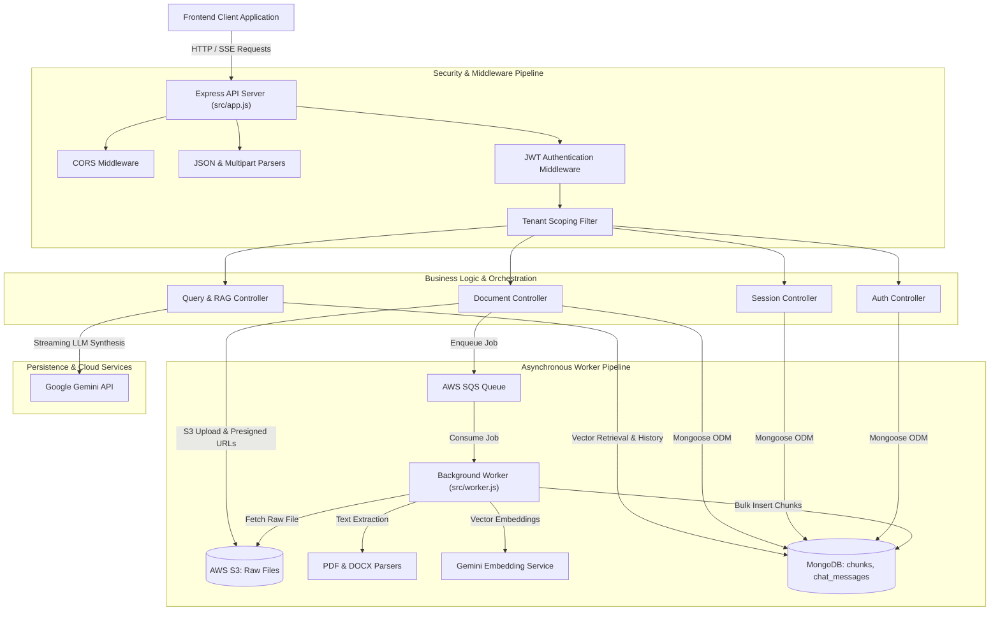
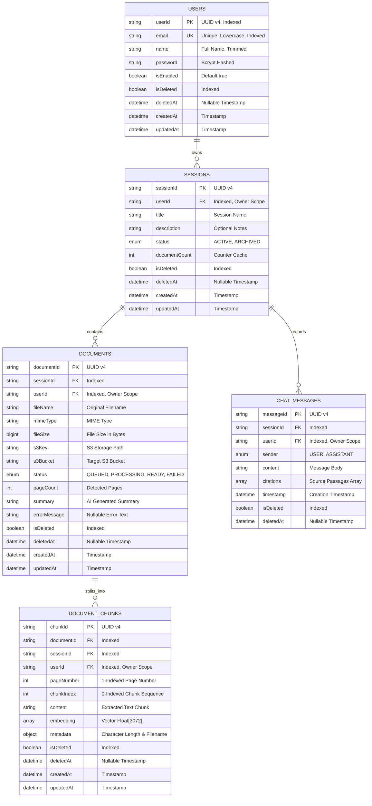
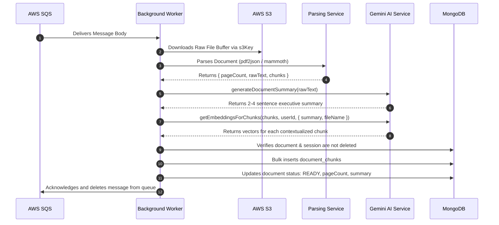

# Backend Technical Requirements Document (BE TRD)
## Document Intelligence & Query System

---

## 1. System Overview & Architecture

The Backend of the **Document Intelligence & Query System** is an asynchronous Node.js application built with Express.js adhering to ES Modules (`type: module`). It utilizes MongoDB as a unified document and vector store, providing a secure, high-concurrency API service responsible for user identity management, multi-format document ingestion, cloud file storage, asynchronous background job queuing, semantic text parsing, vector embedding generation, and real-time streaming conversational question-answering with verifiable citations.

### 1.1 Architectural Principles
- **Unified Document & Vector Store**: MongoDB serves as the single persistence engine for all application entities, storing user accounts, workspace sessions, document metadata, chunk text, 3072-dimensional vector embeddings, and conversational message histories.
- **Tenant Isolation & IDOR Immunity**: Every data entity is strictly scoped to its owner (`userId`). Database queries rigorously enforce owner keys to prevent Insecure Direct Object Reference (IDOR) access.
- **Non-Blocking Asynchronous Ingestion**: Heavy document parsing and vectorization workloads are decoupled from the API request-response cycle using AWS SQS and background worker consumers.
- **Streaming First**: Conversational queries stream synthesized tokens via Server-Sent Events (SSE) directly to the client with sub-second initial token latency.
- **Non-Destructive Data Lifecycle**: All user-facing deletions utilize soft-delete patterns (`isDeleted`, `deletedAt`) to maintain audit trails and recovery capabilities.

### 1.2 System Topology Diagram



---

## 2. Persistence Layer & Data Specifications

### 2.1 Entity Relationship Diagram



### 2.2 MongoDB Collection Specifications

#### 1. Collection: `users`
- **Primary Identifier**: `userId` (String, UUID v4, Unique, Indexed)
- **Attributes**:
  - `email` (String, Required, Unique, Indexed, Lowercase, Trimmed)
  - `name` (String, Required, Trimmed)
  - `password` (String, Required, Bcrypt hashed with salt rounds = 10)
  - `isEnabled` (Boolean, Default: `true`)
  - `isDeleted` (Boolean, Default: `false`, Indexed)
  - `deletedAt` (Date, Nullable, Default: `null`)
  - `createdAt` (Date, Automatic timestamp)
  - `updatedAt` (Date, Automatic timestamp)
- **Indexes**:
  - `{ userId: 1 }` (Unique)
  - `{ email: 1 }` (Unique)
  - `{ isDeleted: 1 }`

#### 2. Collection: `sessions`
- **Primary Identifier**: `sessionId` (String, UUID v4, Unique)
- **Tenant Scope**: `userId` (String, Indexed)
- **Attributes**:
  - `title` (String, Required)
  - `description` (String, Nullable, Default: `null`)
  - `status` (String, Enum: `['ACTIVE', 'ARCHIVED']`, Default: `'ACTIVE'`, Indexed)
  - `documentCount` (Number, Default: 0)
  - `isDeleted` (Boolean, Default: `false`, Indexed)
  - `deletedAt` (Date, Nullable, Default: `null`)
- **Compound Indexes**:
  - `{ userId: 1, status: 1, isDeleted: 1, updatedAt: -1, _id: -1 }` (Enables stable cursor pagination and filtering).

#### 3. Collection: `documents`
- **Primary Identifier**: `documentId` (String, UUID v4, Unique)
- **Foreign Keys**: `sessionId` (String, Indexed), `userId` (String, Indexed)
- **Attributes**:
  - `fileName` (String, Required)
  - `mimeType` (String, Required)
  - `fileSize` (Number, Required, Bytes)
  - `s3Key` (String, Required)
  - `s3Bucket` (String, Required)
  - `status` (String, Enum: `['QUEUED', 'PROCESSING', 'READY', 'FAILED']`, Default: `'QUEUED'`, Indexed)
  - `pageCount` (Number, Default: 0)
  - `summary` (String, Nullable, Default: `null`)
  - `errorMessage` (String, Nullable, Default: `null`)
  - `isDeleted` (Boolean, Default: `false`, Indexed)
  - `deletedAt` (Date, Nullable, Default: `null`)
- **Indexes**:
  - `{ sessionId: 1, userId: 1, isDeleted: 1 }`
  - `{ documentId: 1, userId: 1 }`

#### 4. Collection: `document_chunks`
- **Primary Identifier**: `chunkId` (String, UUID v4, Unique)
- **Foreign Keys**: `documentId` (String, Indexed), `sessionId` (String, Indexed), `userId` (String, Indexed)
- **Attributes**:
  - `pageNumber` (Number, Default: 1)
  - `chunkIndex` (Number, Required)
  - `content` (String, Required)
  - `metadata`: `{ charLength: Number, fileName: String }`
  - `embedding` (Array of Numbers, 3072 dimensions)
  - `isDeleted` (Boolean, Default: `false`, Indexed)
  - `deletedAt` (Date, Nullable, Default: `null`)
- **Indexes**:
  - `{ sessionId: 1, userId: 1, isDeleted: 1 }`
  - `{ documentId: 1, userId: 1 }`

#### 5. Collection: `chat_messages`
- **Primary Identifier**: `messageId` (String, UUID v4, Unique)
- **Foreign Keys**: `sessionId` (String, Indexed), `userId` (String, Indexed)
- **Attributes**:
  - `sender` (String, Enum: `['USER', 'ASSISTANT']`, Required)
  - `content` (String, Required)
  - `citations`: Array of Objects:
    - `documentId` (String)
    - `fileName` (String)
    - `pageNumber` (Number)
    - `snippet` (String, Max 300 characters)
    - `score` (Number, Cosine similarity score)
  - `timestamp` (Date, Default: Current Date)
  - `isDeleted` (Boolean, Default: `false`, Indexed)
  - `deletedAt` (Date, Nullable, Default: `null`)
- **Indexes**:
  - `{ sessionId: 1, userId: 1, isDeleted: 1, timestamp: 1 }`

---

## 3. Global API Design & Protocol Conventions

### 3.1 Base URI & Versioning
All backend API routes are anchored under the `/v1` versioned namespace:
```
https://api.documentprocessor.local/v1
```

### 3.2 Authentication & Authorization Headers
Protected endpoints require an RFC 6750 Bearer token header:
```http
Authorization: Bearer <signed_jwt_token>
```

### 3.3 Standard Response Envelopes

#### Success Envelope (2xx)
```json
{
  "status": "Success",
  "message": "Human-readable confirmation message",
  "statusCode": 200,
  "response": {}
}
```

#### Error Envelope (4xx, 5xx)
```json
{
  "status": "Success",
  "message": "Human-readable error explanation",
  "errorCode": "ERROR_CODE_STRING",
  "error": "Detailed validation or system error string"
}
```

---

## 4. Extensive API Contracts

### 4.1 Authentication Service (`/v1/auth`)

#### 1. User Registration (`POST /v1/auth/signup`)
- **Access**: Public
- **Description**: Registers a new user account with hashed password and generates a JWT session token.
- **Request Headers**:
  - `Content-Type: application/json`
- **Request Body**:
```json
{
  "name": "Jane Doe",
  "email": "jane.doe@example.com",
  "password": "SecurePassword123!"
}
```
- **Validation Constraints**:
  - `name`: String, trimmed, min 2, max 100 characters.
  - `email`: String, valid email format, required.
  - `password`: String, min 6 characters, required.
- **Success Response (201 Created)**:
```json
{
  "status": "Success",
  "message": "User registered successfully",
  "statusCode": 201,
  "response": {
    "user": {
      "userId": "d7b42a9b-3a56-4c28-98e1-5bc430e7162b",
      "name": "Jane Doe",
      "email": "jane.doe@example.com"
    },
    "token": "eyJhbGciOiJIUzI1NiIsInR5cCI6IkpXVCJ9..."
  }
}
```
- **Error Responses**:
  - `400 Bad Request` (`errorCode: "SIGNUP_ERROR"`): Email already registered or invalid fields.

#### 2. User Login (`POST /v1/auth/login`)
- **Access**: Public
- **Description**: Authenticates email and password credentials, returning a signed JWT token.
- **Request Headers**:
  - `Content-Type: application/json`
- **Request Body**:
```json
{
  "email": "jane.doe@example.com",
  "password": "SecurePassword123!"
}
```
- **Success Response (200 OK)**:
```json
{
  "status": "Success",
  "message": "Login successful",
  "statusCode": 200,
  "response": {
    "user": {
      "userId": "d7b42a9b-3a56-4c28-98e1-5bc430e7162b",
      "name": "Jane Doe",
      "email": "jane.doe@example.com"
    },
    "token": "eyJhbGciOiJIUzI1NiIsInR5cCI6IkpXVCJ9..."
  }
}
```
- **Error Responses**:
  - `401 Unauthorized` (`errorCode: "LOGIN_ERROR"`): Invalid email or password.

#### 3. Current User Profile (`GET /v1/auth/me`)
- **Access**: Authenticated (`authenticateToken`)
- **Description**: Returns profile information of the currently authenticated token bearer.
- **Success Response (200 OK)**:
```json
{
  "status": "Success",
  "message": "Current user profile",
  "statusCode": 200,
  "response": {
    "user": {
      "userId": "d7b42a9b-3a56-4c28-98e1-5bc430e7162b",
      "email": "jane.doe@example.com",
      "name": "Jane Doe"
    }
  }
}
```
- **Error Responses**:
  - `401 Unauthorized` (`errorCode: "UNAUTHORIZED"`): Missing or expired Bearer token.

---

### 4.2 Workspace & Session Service (`/v1/sessions`)

#### 4. List Sessions (`GET /v1/sessions`)
- **Access**: Authenticated (`authenticateToken`)
- **Description**: Retrieves a cursor-paginated list of user-owned workspaces filtered by status and search terms.
- **Query Parameters**:
  - `status` (string, optional, enum: `ACTIVE`, `ARCHIVED`, default: `ACTIVE`)
  - `cursor` (string, optional): Base64-encoded JSON cursor `{"updatedAt":"...","_id":"..."}`
  - `limit` (integer, optional, min: 1, max: 50, default: 12)
  - `search` (string, optional): Regex search string across `title` and `description`.
- **Success Response (200 OK)**:
```json
{
  "status": "Success",
  "message": "Sessions fetched successfully",
  "statusCode": 200,
  "response": {
    "sessions": [
      {
        "sessionId": "a9082ef1-1824-4f29-a1b7-cd349281a890",
        "userId": "d7b42a9b-3a56-4c28-98e1-5bc430e7162b",
        "title": "Q3 Financial Audit",
        "description": "Cross-examination of quarterly balance sheets and filings.",
        "status": "ACTIVE",
        "documentCount": 3,
        "isDeleted": false,
        "deletedAt": null,
        "createdAt": "2026-09-17T18:00:00.000Z",
        "updatedAt": "2026-09-17T18:30:00.000Z"
      }
    ],
    "nextCursor": "eyJ1cGRhdGVkQXQiOiIyMDI2LTA5LTE3VDE4OjMwOjAwLjAwMFoiLCJfaWQiOiI2NGVmYWI...\"==",
    "hasMore": true
  }
}
```
- **Error Responses**:
  - `400 Bad Request` (`errorCode: "BAD_REQUEST"`): Malformed base64 cursor string.

#### 5. Get Single Session (`GET /v1/sessions/:id`)
- **Access**: Authenticated (`authenticateToken`)
- **Description**: Fetches detailed session metadata by ID. Strictly scoped to authenticated user to verify ownership.
- **Path Parameters**:
  - `id`: Session UUID.
- **Success Response (200 OK)**:
```json
{
  "status": "Success",
  "message": "Session fetched successfully",
  "statusCode": 200,
  "response": {
    "sessionId": "a9082ef1-1824-4f29-a1b7-cd349281a890",
    "userId": "d7b42a9b-3a56-4c28-98e1-5bc430e7162b",
    "title": "Q3 Financial Audit",
    "description": "Quarterly balance sheets and filings.",
    "status": "ACTIVE",
    "documentCount": 3,
    "isDeleted": false,
    "deletedAt": null,
    "createdAt": "2026-09-17T18:00:00.000Z",
    "updatedAt": "2026-09-17T18:30:00.000Z"
  }
}
```
- **Error Responses**:
  - `404 Not Found` (`errorCode: "FORBIDDEN"`): Session does not exist, is soft-deleted, or belongs to another user.

#### 6. Create Session (`POST /v1/sessions`)
- **Access**: Authenticated (`authenticateToken`)
- **Description**: Creates a new workspace session bound to the caller's `userId`.
- **Request Body**:
```json
{
  "title": "Vendor Contract Review",
  "description": "Master Services Agreements 2026"
}
```
- **Success Response (201 Created)**:
```json
{
  "status": "Success",
  "message": "Session created successfully",
  "statusCode": 201,
  "response": {
    "sessionId": "b11c9902-12f4-4e2b-b991-83da901c381f",
    "userId": "d7b42a9b-3a56-4c28-98e1-5bc430e7162b",
    "title": "Vendor Contract Review",
    "description": "Master Services Agreements 2026",
    "status": "ACTIVE",
    "documentCount": 0,
    "isDeleted": false,
    "deletedAt": null,
    "createdAt": "2026-09-17T19:00:00.000Z",
    "updatedAt": "2026-09-17T19:00:00.000Z"
  }
}
```
- **Error Responses**:
  - `400 Bad Request` (`errorCode: "Validation Error"`): Session title is missing or blank.

#### 7. Update Session (`PATCH /v1/sessions/:id`)
- **Access**: Authenticated (`authenticateToken`)
- **Description**: Updates workspace title, description, or status (`ACTIVE` vs `ARCHIVED`).
- **Path Parameters**:
  - `id`: Session UUID.
- **Request Body**:
```json
{
  "title": "Vendor Contract Review (Archived)",
  "status": "ARCHIVED"
}
```
- **Success Response (200 OK)**:
```json
{
  "status": "Success",
  "message": "Session updated successfully",
  "statusCode": 200,
  "response": {
    "sessionId": "b11c9902-12f4-4e2b-b991-83da901c381f",
    "userId": "d7b42a9b-3a56-4c28-98e1-5bc430e7162b",
    "title": "Vendor Contract Review (Archived)",
    "status": "ARCHIVED",
    "documentCount": 2,
    "updatedAt": "2026-09-17T19:15:00.000Z"
  }
}
```
- **Error Responses**:
  - `404 Not Found` (`errorCode: "FORBIDDEN"`): Session not found or owned by another tenant.

#### 8. Delete Session (`DELETE /v1/sessions/:id`)
- **Access**: Authenticated (`authenticateToken`)
- **Description**: Executes cascading soft deletion across the session, its documents, chunks, and chat messages in MongoDB while preserving raw files in S3.
- **Path Parameters**:
  - `id`: Session UUID.
- **Success Response (200 OK)**:
```json
{
  "status": "Success",
  "message": "Session and associated documents deleted successfully",
  "statusCode": 200,
  "response": null
}
```
- **Error Responses**:
  - `404 Not Found` (`errorCode: "FORBIDDEN"`): Target session not found or unauthorized.

---

### 4.3 Document Ingestion & Storage Service (`/v1/sessions/:id/documents`)

#### 9. List Documents (`GET /v1/sessions/:id/documents`)
- **Access**: Authenticated (`authenticateToken`)
- **Description**: Returns all non-deleted documents in the session.
- **Path Parameters**:
  - `id`: Session UUID.
- **Success Response (200 OK)**:
```json
{
  "status": "Success",
  "message": "Documents fetched successfully",
  "statusCode": 200,
  "response": [
    {
      "documentId": "c88f9104-e349-49aa-9b1b-90a4175317b2",
      "sessionId": "a9082ef1-1824-4f29-a1b7-cd349281a890",
      "userId": "d7b42a9b-3a56-4c28-98e1-5bc430e7162b",
      "fileName": "q3_filing.pdf",
      "mimeType": "application/pdf",
      "fileSize": 524288,
      "s3Key": "sessions/a9082ef1-1824-4f29-a1b7-cd349281a890/c88f9104-e349-49aa-9b1b-90a4175317b2/q3_filing.pdf",
      "s3Bucket": "s3-document-processor",
      "status": "READY",
      "pageCount": 14,
      "summary": "Quarterly balance sheet indicating 18% YoY net income growth.",
      "createdAt": "2026-09-17T18:10:00.000Z"
    }
  ]
}
```

#### 10. Upload Documents (`POST /v1/sessions/:id/documents`)
- **Access**: Authenticated (`authenticateToken`)
- **Description**: Receives multipart file uploads, uploads raw files to AWS S3, persists document records with status `PROCESSING`, and dispatches background processing jobs to AWS SQS.
- **Path Parameters**:
  - `id`: Session UUID.
- **Request Headers**:
  - `Content-Type: multipart/form-data`
- **Request Payload**:
  - Field name: `files` (array of multipart file buffers; configurable thresholds with initial defaults: max 10 MB per file, max 10 files per batch).
  - Allowed file formats:
    - Documents: PDF (`application/pdf`), Word DOCX (`application/vnd.openxmlformats-officedocument.wordprocessingml.document`)
    - Plaintext & Markdown: TXT (`text/plain`), MD (`text/markdown`, `text/x-markdown`, `.md`, `.markdown`)
    - Tabular & Structured Data: CSV (`text/csv`, `application/csv`, `text/x-csv`), TSV (`text/tab-separated-values`, `text/tsv`), JSON (`application/json`, `text/json`), XML (`application/xml`, `text/xml`), YAML (`application/x-yaml`, `text/yaml`, `text/x-yaml`, `.yaml`, `.yml`)
    - Markup & Logs: HTML (`text/html`, `.html`, `.htm`), Logs (`text/plain`, `text/x-log`, `.log`)
    - Images: PNG (`image/png`), JPEG (`image/jpeg`, `.jpg`, `.jpeg`), WebP (`image/webp`), BMP (`image/bmp`), TIFF (`image/tiff`, `.tif`)
    - *(Executable code formats like .py, .js, .ts, .sh, .sql are rejected by fileFilter)*
- **Success Response (202 Accepted)**:
```json
{
  "status": "Success",
  "message": "Documents uploaded and processing started",
  "statusCode": 202,
  "response": [
    {
      "documentId": "e12f0092-23aa-4481-912a-338294103810",
      "sessionId": "a9082ef1-1824-4f29-a1b7-cd349281a890",
      "userId": "d7b42a9b-3a56-4c28-98e1-5bc430e7162b",
      "fileName": "balance_sheet.pdf",
      "mimeType": "application/pdf",
      "fileSize": 412980,
      "s3Key": "sessions/a9082ef1-1824-4f29-a1b7-cd349281a890/e12f0092-23aa-4481-912a-338294103810/balance_sheet.pdf",
      "s3Bucket": "s3-document-processor",
      "status": "PROCESSING",
      "pageCount": 0
    }
  ]
}
```
- **Error Responses**:
  - `400 Bad Request` (`errorCode: "Validation Error"`): No files uploaded, batch count exceeded, or invalid file format.
  - `403 Forbidden` (`errorCode: "SESSION_ARCHIVED"`): Session is archived; document uploads are blocked until restored.
  - `413 Payload Too Large`: Uploaded file exceeds configured file size limit (initial default: 10 MB).

#### 11. Document Preview & Presigned URL (`GET /v1/sessions/:id/documents/:docId/preview`)
- **Access**: Authenticated (`authenticateToken`)
- **Description**: Generates temporary AWS S3 presigned URLs for inline viewing and attachment download, accompanied by a partial text buffer preview.
- **Path Parameters**:
  - `id`: Session UUID.
  - `docId`: Document UUID.
- **Success Response (200 OK)**:
```json
{
  "status": "Success",
  "message": "Presigned preview URL generated",
  "statusCode": 200,
  "response": {
    "url": "https://s3-document-processor.s3.ap-south-1.amazonaws.com/sessions/...?X-Amz-Signature=...",
    "downloadUrl": "https://s3-document-processor.s3.ap-south-1.amazonaws.com/sessions/...?response-content-disposition=attachment...",
    "summary": "Quarterly balance sheet indicating 18% YoY net income growth.",
    "pageCount": 14,
    "fileName": "balance_sheet.pdf",
    "mimeType": "application/pdf",
    "fileSize": 412980,
    "previewText": "CONSOLIDATED STATEMENT OF EARNINGS...",
    "isTruncated": false,
    "maxPreviewBytes": 256000
  }
}
```

#### 12. Retry Document Ingestion (`POST /v1/sessions/:id/documents/:docId/retry`)
- **Access**: Authenticated (`authenticateToken`)
- **Description**: Clears previously failed chunks, resets document status to `PROCESSING`, and re-queues ingestion through AWS SQS.
- **Success Response (200 OK)**:
```json
{
  "status": "Success",
  "message": "Document retry scheduled successfully",
  "statusCode": 200,
  "response": {
    "documentId": "e12f0092-23aa-4481-912a-338294103810",
    "status": "PROCESSING",
    "errorMessage": null
  }
}
```
- **Error Responses**:
  - `403 Forbidden` (`errorCode: "SESSION_ARCHIVED"`): Session is archived; document retry is blocked until restored.
  - `404 Not Found` (`errorCode: "FORBIDDEN"`): Document or session not found or unauthorized.

#### 13. Delete Document (`DELETE /v1/sessions/:id/documents/:docId`)
- **Access**: Authenticated (`authenticateToken`)
- **Description**: Soft deletes a document and all its corresponding chunks in MongoDB and decrements the workspace document count.
- **Success Response (200 OK)**:
```json
{
  "status": "Success",
  "message": "Document deleted successfully",
  "statusCode": 200,
  "response": null
}
```

---

### 4.4 Conversational Query & RAG Service (`/v1/sessions/:id`)

#### 14. Conversational Session Query (`POST /v1/sessions/:id/query`)
- **Access**: Authenticated (`authenticateToken`)
- **Description**: Performs cosine semantic retrieval across session document chunks, synthesizes answers using Google Gemini LLM, and emits responses either synchronously or as an SSE stream.
- **Path Parameters**:
  - `id`: Session UUID.
- **Request Body**:
```json
{
  "prompt": "What was the operating cash flow in Q3?",
  "stream": true
}
```

##### Protocol Option A: Streaming Mode (`stream: true`)
- **Response Headers**:
  - `Content-Type: text/event-stream`
  - `Cache-Control: no-cache`
  - `Connection: keep-alive`
- **Stream Frame Flow**:
```
data: {"type":"token","content":"Based"}

data: {"type":"token","content":" on"}

data: {"type":"token","content":" the Q3 balance sheet [1], operating cash flow reached $4.2M."}

data: {"type":"citations","citations":[{"documentId":"e12f0092-23aa-4481-912a-338294103810","fileName":"balance_sheet.pdf","pageNumber":3,"snippet":"Cash flows from operating activities totaled $4,200,000 for the quarter ended September 30...","score":0.892}]}

data: [DONE]
```

##### Protocol Option B: Synchronous Mode (`stream: false`)
- **Success Response (200 OK)**:
```json
{
  "status": "Success",
  "message": "Query successful",
  "statusCode": 200,
  "response": {
    "answer": "Based on the Q3 balance sheet [1], operating cash flow reached $4.2M.",
    "citations": [
      {
        "documentId": "e12f0092-23aa-4481-912a-338294103810",
        "fileName": "balance_sheet.pdf",
        "pageNumber": 3,
        "snippet": "Cash flows from operating activities totaled $4,200,000 for the quarter ended September 30...",
        "score": 0.892
      }
    ]
  }
}
```
- **Error Responses**:
  - `400 Bad Request` (`errorCode: "Validation Error"`): Prompt missing or blank.
  - `403 Forbidden` (`errorCode: "SESSION_ARCHIVED"`): Session is archived; conversational queries are blocked until restored.
  - `404 Not Found` (`errorCode: "FORBIDDEN"`): Session not found or unauthorized.

#### 15. Message History (`GET /v1/sessions/:id/messages`)
- **Access**: Authenticated (`authenticateToken`)
- **Description**: Retrieves the complete chat message timeline for the specified session.
- **Path Parameters**:
  - `id`: Session UUID.
- **Success Response (200 OK)**:
```json
{
  "status": "Success",
  "message": "Messages retrieved successfully",
  "statusCode": 200,
  "response": [
    {
      "messageId": "91a82f31-89ab-4881-8172-11a3b4c5d6e7",
      "sessionId": "a9082ef1-1824-4f29-a1b7-cd349281a890",
      "userId": "d7b42a9b-3a56-4c28-98e1-5bc430e7162b",
      "sender": "USER",
      "content": "What was the operating cash flow in Q3?",
      "citations": [],
      "timestamp": "2026-09-17T19:20:00.000Z"
    },
    {
      "messageId": "88e71b22-990a-4221-a1b2-22c3d4e5f6a7",
      "sessionId": "a9082ef1-1824-4f29-a1b7-cd349281a890",
      "userId": "d7b42a9b-3a56-4c28-98e1-5bc430e7162b",
      "sender": "ASSISTANT",
      "content": "Based on the Q3 balance sheet [1], operating cash flow reached $4.2M.",
      "citations": [
        {
          "documentId": "e12f0092-23aa-4481-912a-338294103810",
          "fileName": "balance_sheet.pdf",
          "pageNumber": 3,
          "snippet": "Cash flows from operating activities totaled $4,200,000 for the quarter ended September 30...",
          "score": 0.892
        }
      ],
      "timestamp": "2026-09-17T19:20:02.000Z"
    }
  ]
}
```

---

## 5. Asynchronous Message Queue Contract & Worker Processing (AWS SQS)

### 5.1 Queue Topology & Polling Configuration
- **Primary Queue**: `document_processing_queue_${ENVIRONMENT}` (dead-letter queue enabled)
- **Visibility Timeout**: 180 seconds
- **Message Retention**: 4 days
- **Long Polling Wait Time**: 20 seconds (`waitTimeSeconds: 20` and queue attribute `ReceiveMessageWaitTimeSeconds: 20`) to eliminate empty receive calls and conserve polling capacity.
- **Polling Delay**: 1 second (`pollingWaitTimeMs: 1000`) short throttle pause between poll cycles ensuring sub-second message ingestion latency without over-polling.
- **Consumer Framework**: `sqs-consumer` long-polling with graceful shutdown hooks (`SIGINT`, `SIGTERM`).

### 5.2 SQS Message Payload Data Contract
```json
{
  "documentId": "e12f0092-23aa-4481-912a-338294103810",
  "sessionId": "a9082ef1-1824-4f29-a1b7-cd349281a890",
  "userId": "d7b42a9b-3a56-4c28-98e1-5bc430e7162b",
  "s3Key": "sessions/a9082ef1-1824-4f29-a1b7-cd349281a890/e12f0092-23aa-4481-912a-338294103810/balance_sheet.pdf",
  "fileName": "balance_sheet.pdf",
  "mimeType": "application/pdf"
}
```

### 5.3 Worker Processing Sequence



### 5.4 In-Process Fallback Mode
If AWS SQS is unreachable or disabled during local development, the API controller catches the queue failure and immediately executes the parsing and embedding pipeline asynchronously within the Node.js event loop using cooperative scheduling (`setImmediate`), ensuring local workflows proceed without interruption.

---

## 6. Document Parsing, Chunking & RAG Retrieval Pipeline

### 6.1 Parsing Algorithms
- **PDF Documents**: Page-level extraction using `pdf2json`. Handles URI-encoded character recovery and defensive fallbacks to preserve structural page boundaries.
- **DOCX Documents**: Native extraction via `mammoth`, converting Word paragraphs and tables into structured clean text.
- **Scanned Documents & Images**: Optical Character Recognition (OCR) via Tesseract OCR engine (`tesseract.js`), extracting text across PNG, JPEG, WebP, BMP, and TIFF assets.
- **Plain Text & Structured Data (TXT, MD, CSV, TSV, JSON, XML, HTML, YAML, LOG)**: Direct UTF-8 buffer decoding (`buffer.toString('utf-8')`) with line-break normalization, preserving structural formatting, markdown syntax, CSV rows, and JSON/YAML hierarchy for chunking.

### 6.2 Chunking Specifications
- **Target Chunk Size**: ~1,200 characters per chunk.
- **Chunk Overlap**: 200 characters to prevent loss of context across boundaries.
### 6.3 Embedding & Vector Similarity Algorithm
- **Embedding Model**: `gemini-embedding-001` (768-dimensional vector floats).
- **Contextual Embedding Ingestion**: To prevent semantic drift across segmented chunks, each chunk is contextualized with the document name and executive summary prior to vector calculation:
  ```text
  Document: [fileName]
  Summary: [summary]

  Content:
  [chunk.content]
  ```
  Original clean content is saved to MongoDB for citations and rendering.
- **Vector Retrieval**: Computes dot-product cosine similarity between the query embedding and stored chunk vectors:
```
Cosine Similarity = (A · B) / (||A|| * ||B||)
```
- **Filter Constraints**: Strictly scoped to `{ sessionId, userId, isDeleted: false }`.
- **Top-K Selection**: Top chunks (default 8) exceeding similarity threshold are assembled into the conversational prompt context.

### 6.4 Conversational Memory Window
- **Sliding History Window**: RAG completions retrieve the last 6 messages (`CHAT_HISTORY_MESSAGE_LIMIT: 6`) for the active session and user.
- **Dialogue Injection**: Prior turns (`User: ...` / `Assistant: ...`) are injected before the current user question, maintaining pronoun reference resolution and conversational coherence.

### 6.5 Model Fallback Cascade
To safeguard against rate limits or service degradation, LLM calls cascade through multiple model configurations:
1. Primary: `gemini-3.5-flash`
2. Fallback: `gemini-3.5-flash-lite`, `gemini-3.6-flash`

---

## 7. Security Architecture & IDOR Prevention

### 7.1 Token Verification
All protected requests execute the `authenticateToken` middleware:
1. Extracts `Authorization: Bearer <token>` header.
2. Verifies cryptographic signature using HMAC-SHA256 (`JWT_SECRET`).
3. Decodes user payload and attaches `req.user = { userId, email, name }`.
4. Rejects unauthenticated requests with `401 Unauthorized`.

### 7.2 Database Tenant Scoping Rules
Every repository query enforces ownership through compound criteria:
- **Session Operations**: `{ sessionId: req.params.id, userId: req.user.userId, isDeleted: false }`
- **Document Operations**: `{ documentId: req.params.docId, sessionId: req.params.id, userId: req.user.userId, isDeleted: false }`
- **Chunk Queries**: `{ sessionId: req.params.id, userId: req.user.userId, isDeleted: false }`
- **Message Queries**: `{ sessionId: req.params.id, userId: req.user.userId, isDeleted: false }`

If a user attempts to access or mutate an ID belonging to another user, the query resolves to `null`, and the API returns a `404 Not Found` / `403 Forbidden` envelope, preventing enumeration and data exposure.

### 7.3 Archived Session Read-Only Enforcement
When a session is marked as `ARCHIVED` (`session.status === 'ARCHIVED'`), the backend enforces strict read-only guarantees on mutating operations:
- **Blocked Actions**:
  - `POST /v1/sessions/:id/documents` (upload documents)
  - `POST /v1/sessions/:id/documents/:docId/retry` (retry failed ingestion)
  - `POST /v1/sessions/:id/query` (natural language RAG queries)
  - Attempting any of these returns `403 Forbidden` with `errorCode: "SESSION_ARCHIVED"`.
- **Allowed Actions**:
  - Reading metadata (`GET /v1/sessions/:id`)
  - Listing documents (`GET /v1/sessions/:id/documents`)
  - Document previews and downloads (`GET /v1/sessions/:id/documents/:docId/preview`)
  - Deleting documents (`DELETE /v1/sessions/:id/documents/:docId`)
  - Viewing message history (`GET /v1/sessions/:id/messages`)
  - Restoring the session (`PATCH /v1/sessions/:id` with `{ status: "ACTIVE" }`)
  - Deleting the session (`DELETE /v1/sessions/:id`)
- **Zero-Redundancy Implementation**: Checks are evaluated directly after the tenant-scoping fetch in each controller (`uploadDocuments`, `retryDocument`, `querySession`), preventing redundant database lookups.

---

## 8. Configuration & Environment Matrix

| Variable Key | Type | Required | Default | Description |
| :--- | :--- | :--- | :--- | :--- |
| `ENV` | String | Yes | `local` | Application runtime environment (`local`, `dev`, `prod`). |
| `PORT` | Integer | Yes | `3000` | HTTP listening port for Express application server. |
| `MONGO_HOST_IP` | String | Yes | `127.0.0.1:27017` | MongoDB host IP and port address. |
| `MONGO_USER` | String | Yes | `root` | MongoDB connection username. |
| `MONGO_PASSWORD` | String | Yes | None | MongoDB connection password. |
| `MONGO_DATABASE` | String | Yes | `document_processor` | Target MongoDB database name. |
| `MONGO_SRV_FLAG` | Boolean | No | `false` | Enable DNS SRV connection strings for MongoDB Atlas. |
| `JWT_SECRET` | String | Yes | None | Secret key used for signing and verifying JWT tokens. |
| `JWT_EXPIRES_IN` | String | No | `7d` | JWT token validity window. |
| `AWS_REGION` | String | Yes | `ap-south-1` | AWS deployment region for S3 and SQS. |
| `AWS_ACCESS_KEY_ID` | String | Yes | None | AWS IAM Access Key ID. |
| `AWS_SECRET_ACCESS_KEY` | String | Yes | None | AWS IAM Secret Access Key. |
| `AWS_S3_BUCKET_NAME` | String | Yes | None | Target AWS S3 bucket for raw document storage. |
| `AWS_SQS_DOCUMENT_PROCESSING_QUEUE` | String | No | `document_processing_queue_local` | AWS SQS queue name for document ingestion jobs. |
| `AWS_SQS_WAIT_TIME_SECONDS` | Integer | No | `20` | Duration (seconds) for SQS long-polling wait time (max 20s). |
| `AWS_SQS_POLLING_WAIT_TIME_MS` | Integer | No | `1000` | Delay (milliseconds) to wait before repolling the queue (1s throttle). |
| `MAX_FILE_SIZE_MB` | Integer | No | `10` | Maximum allowable file size in megabytes for uploaded documents (configurable). |
| `MAX_BATCH_FILE_COUNT` | Integer | No | `10` | Maximum allowable number of files per batch upload action (configurable). |
| `GEMINI_API_KEY` | String | Yes | None | Google Cloud Gemini API key for embeddings and generation. |
| `GEMINI_LLM_MODEL` | String | No | `gemini-2.5-flash` | Primary Gemini model identifier for conversational Q&A. |
| `GEMINI_EMBEDDING_MODEL` | String | No | `gemini-embedding-001` | Gemini model identifier for text vector embeddings. |
