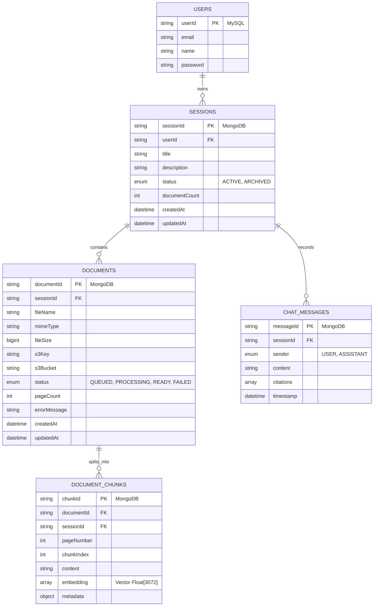
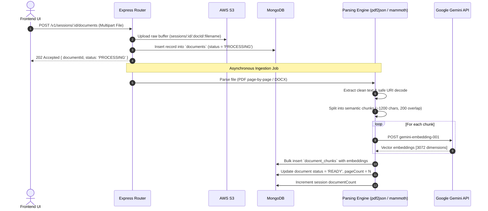
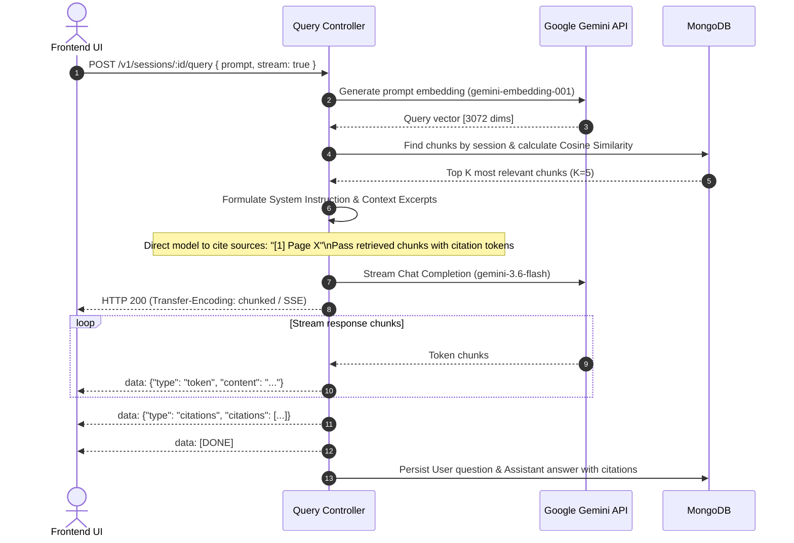

# Backend Technical Requirements Document (BE TRD)
## Document Intelligence & Query System

---

## 1. Executive Summary & System Scope

The Backend of the **Document Intelligence & Query System** is an asynchronous, dual-persistence Node.js service (Express.js, ES Modules) responsible for:
1. **Workspace & Session Orchestration**: CRUD operations, archiving, and state management for user sessions in **MongoDB**.
2. **Secure Cloud File Ingestion**: Receiving multi-format documents (PDF, DOCX, TXT, images) and storing originals in **AWS S3** (`ap-south-1`).
3. **Document Extraction & Processing Pipeline**: Parsing native text via `pdf2json` (with safe UTF-8/URI decoding) and `mammoth` (DOCX), structural extraction (pages, sections), and chunking.
4. **Vector Embedding & Persistence**: Computing vector embeddings via **Google Gemini Embedding API** (`gemini-embedding-001`, 3072-dimensional) and storing high-dimensional vectors in **MongoDB**.
5. **RAG & Conversational Q&A**: Performing cosine semantic retrieval, context window assembly, and token-by-token streaming responses with source citations via **Google Gemini** (`gemini-3.6-flash`).
6. **User Account Persistence**: Maintaining core user accounts and credentials in **MySQL** (Sequelize).

---

## 2. Technical Stack & Core Dependencies

| Concern / Layer | Technology / Library | Role & Justification |
| :--- | :--- | :--- |
| **Runtime & Framework** | Node.js (ESM) + Express.js (`v4.21.1`) | High-concurrency event-driven API server |
| **Document, Session & Vector Store** | MongoDB + Mongoose (`v8.8.1`) | Sessions, documents metadata, semi-structured chunks, embeddings, and chat history with auto collection creation |
| **User Persistence** | MySQL 8.x + Sequelize ORM (`v6.37.5`) | Transactional persistence strictly for `users` |
| **Cloud File Storage** | AWS S3 (`@aws-sdk/client-s3`, `@aws-sdk/s3-request-presigner`) | Scalable, encrypted raw document object store (`ap-south-1`) |
| **File Upload Handling** | `multer` (memory storage) | Multipart form-data handling with MIME-type and size guards |
| **AI & LLM Services** | Google Gemini API (`@google/genai` v2) | Embedding generation (`gemini-embedding-001`) & streaming generation (`gemini-3.6-flash`) |
| **Document Parsers** | `pdf2json`, `mammoth` | Page-level PDF text extraction and DOCX parsing with safe URI decoding |
| **Validation & Security** | `joi`, `jsonwebtoken`, `bcryptjs`, `cors` | Schema validation and auth middleware |

---

## 3. Database Architecture & Schemas



### 3.1. MySQL Schema (Sequelize)

#### `users`
- `userId`: `STRING(36)` (Primary Key)
- `name`: `STRING`
- `email`: `STRING` (Unique, Not Null)
- `password`: `STRING` (Hashed)
- `isEnabled`: `BOOLEAN` (Default: true)

---

### 3.2. MongoDB Schemas (Mongoose)

#### `sessions` Collection
```javascript
{
  sessionId: { type: String, required: true, unique: true },
  userId: { type: String, default: null, index: true },
  title: { type: String, required: true },
  description: { type: String, default: null },
  status: { type: String, enum: ['ACTIVE', 'ARCHIVED'], default: 'ACTIVE', index: true },
  documentCount: { type: Number, default: 0 }
}
```

#### `documents` Collection
```javascript
{
  documentId: { type: String, required: true, unique: true },
  sessionId: { type: String, required: true, index: true },
  fileName: { type: String, required: true },
  mimeType: { type: String, required: true },
  fileSize: { type: Number, required: true },
  s3Key: { type: String, required: true },
  s3Bucket: { type: String, required: true },
  status: { type: String, enum: ['QUEUED', 'PROCESSING', 'READY', 'FAILED'], default: 'QUEUED', index: true },
  pageCount: { type: Number, default: 0 },
  errorMessage: { type: String, default: null }
}
```

#### `document_chunks` Collection
```javascript
{
  chunkId: { type: String, required: true, unique: true },
  documentId: { type: String, required: true, index: true },
  sessionId: { type: String, required: true, index: true },
  pageNumber: { type: Number, default: 1 },
  chunkIndex: { type: Number, required: true },
  content: { type: String, required: true },
  metadata: {
    charLength: Number,
    fileName: String
  },
  embedding: { type: [Number], default: [] } // 3072 dimensions from gemini-embedding-001
}
```

#### `chat_messages` Collection
```javascript
{
  messageId: { type: String, required: true, unique: true },
  sessionId: { type: String, required: true, index: true },
  sender: { type: String, enum: ['USER', 'ASSISTANT'], required: true },
  content: { type: String, required: true },
  citations: [
    {
      documentId: String,
      fileName: String,
      pageNumber: Number,
      snippet: String,
      score: Number
    }
  ],
  timestamp: { type: Date, default: Date.now }
}
```

---

## 4. Document Ingestion, S3 & Parsing Pipeline



---

## 5. Google Gemini RAG & Streaming Pipeline



---

## 6. REST API Specification

### 6.1. Sessions API
- `GET /v1/sessions`: List sessions for user. Query params: `status` (`ACTIVE` | `ARCHIVED`).
- `POST /v1/sessions`: Create new session. Body: `{ "title": "...", "description": "..." }`.
- `PATCH /v1/sessions/:id`: Update session title or status (`status: "ARCHIVED"` / `"ACTIVE"`).
- `DELETE /v1/sessions/:id`: Cascaded deletion of S3 objects, MongoDB session, documents, chunks, and chat history.

### 6.2. Documents API
- `POST /v1/sessions/:id/documents`: Multipart upload (`files[]`). Uploads to S3, registers in MongoDB, and triggers async parsing + embedding.
- `GET /v1/sessions/:id/documents`: List documents belonging to session.
- `GET /v1/sessions/:id/documents/:docId/preview`: Generate presigned AWS S3 `GetObject` URL for document preview.
- `DELETE /v1/sessions/:id/documents/:docId`: Remove document from MongoDB, delete S3 object, and clear associated chunks.

### 6.3. Conversational Query & Chat API
- `POST /v1/sessions/:id/query`: Ask question over session documents.
  - Body: `{ "prompt": "What are the liabilities?", "stream": true }`.
  - Response: Server-Sent Events (`text/event-stream`) streaming answer tokens followed by citation references.
- `GET /v1/sessions/:id/messages`: Retrieve chat message history.

---

## 7. Cloud & Configuration Variables (`.env`)

```ini
ENV=local
PORT=3000

# MongoDB Configuration
MONGO_HOST_IP=127.0.0.1:27017
MONGO_USER=root
MONGO_PASSWORD=password
MONGO_DATABASE=document_processor
MONGO_SRV_FLAG=false

# MySQL Configuration (strictly for users)
MYSQL_HOST_IP=127.0.0.1
MYSQL_USER=root
MYSQL_PASSWORD=password
MYSQL_DATABASE=document_processor

# Google Gemini API
GEMINI_API_KEY=AIzaSy...
GEMINI_LLM_MODEL=gemini-3.6-flash
GEMINI_EMBEDDING_MODEL=gemini-embedding-001

# AWS S3 Configuration
AWS_REGION=ap-south-1
AWS_ACCESS_KEY_ID=AKIA...
AWS_SECRET_ACCESS_KEY=...
AWS_S3_BUCKET_NAME=s3-document-processor
```
