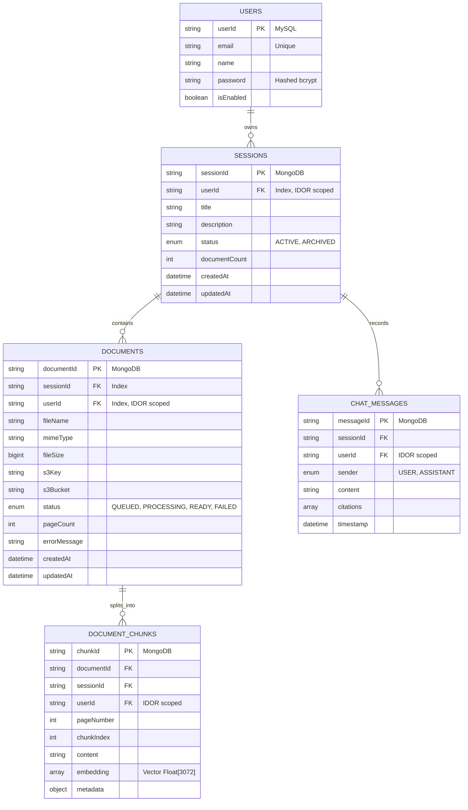
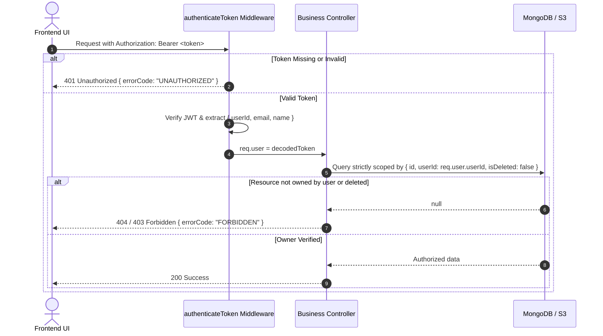

# Backend Technical Requirements Document (BE TRD)
## Document Intelligence & Query System

---

## 1. Executive Summary & System Scope

The Backend of the **Document Intelligence & Query System** is an asynchronous, dual-persistence Node.js service (Express.js, ES Modules) responsible for:
1. **Authentication & IDOR Protection**: User registration/login with email and password via bcrypt + JWT. Middleware-level Bearer token verification with decrypted `req.user` attached to all requests. Strict owner `userId` scoping across all database operations to prevent IDOR attacks.
2. **Workspace & Session Orchestration**: CRUD operations, archiving, and state management for user sessions in **MongoDB** (`sessions`). Supports cursor-based pagination with indexed compound sorting `(userId, status, isDeleted, updatedAt, _id)` and session retrieval by ID (`GET /v1/sessions/:id`) for page reload persistence.
3. **Secure Cloud File Ingestion**: Receiving multi-format documents (PDF, DOCX, TXT, images) up to 1 MB per file (max 4 files) and storing raw originals in **AWS S3** (`ap-south-1`).
4. **Asynchronous SQS Queue Processing**: Offloading document extraction tasks via AWS SQS queue (`document_processing_queue_local`) consumed by background workers to preserve server responsiveness.
5. **Document Extraction & Processing Pipeline**: Parsing native text via `pdf2json` (with safe URI decoding) and `mammoth` (DOCX), structural extraction, and cooperative event loop yielding (`setImmediate`) to prevent event loop starvation.
6. **Vector Embedding & Persistence**: Computing vector embeddings via **Google Gemini Embedding API** (`gemini-embedding-001`, 3072-dimensional) and storing high-dimensional vectors in **MongoDB** (`document_chunks`), stamped with `userId`.
7. **RAG & Conversational Q&A**: Performing cosine semantic retrieval scoped by `userId`, context window assembly, and token-by-token streaming responses with source citations via **Google Gemini** with multi-model fallback cascade.
8. **Soft Deletion Persistence**: All entities (sessions, documents, chunks, chat messages) utilize non-destructive soft deletion (`isDeleted: true`, `deletedAt`).
9. **User Account Persistence**: Maintaining core user accounts and credentials in **MySQL** (`users` table, Sequelize).

---

## 2. Technical Stack & Core Dependencies

| Concern / Layer | Technology / Library | Role & Justification |
| :--- | :--- | :--- |
| **Runtime & Framework** | Node.js (ESM) + Express.js (`v4.21.1`) | High-concurrency event-driven API server |
| **Authentication** | `jsonwebtoken`, `bcryptjs` | JWT Bearer token issuance & validation, password hashing with salt 10 |
| **Document, Session & Vector Store** | MongoDB + Mongoose (`v8.8.1`) | Sessions, documents, chunks, embeddings, and chat history with soft delete and compound cursor index support |
| **User Persistence** | MySQL 8.x + Sequelize ORM (`v6.37.5`) | Transactional persistence strictly for `users` |
| **Cloud File Storage** | AWS S3 (`@aws-sdk/client-s3`, `@aws-sdk/s3-request-presigner`) | Scalable, encrypted raw document object store (`ap-south-1`) |
| **Job Queue & Asynchronous Processing** | AWS SQS (`@aws-sdk/client-sqs`, `sqs-consumer`) | Asynchronous job dispatching and dedicated consumer worker |
| **File Upload Handling** | `multer` (memory storage) | Multipart form-data handling with MIME-type and 1MB size limit constants |
| **AI & LLM Services** | Google Gemini API (`@google/genai` v2) | Embedding generation (`gemini-embedding-001`) & streaming generation with fallback cascade |
| **Document Parsers** | `pdf2json`, `mammoth` | Page-level PDF text extraction and DOCX parsing with safe URI decoding and event-loop yielding |
| **Validation & Security** | `joi`, `cors` | Joi request schema validation and CORS configuration |

---

## 3. Database Architecture & Schemas



### 3.1. MySQL Schema (Sequelize)

#### `users`
- `userId`: `STRING(36)` (Primary Key)
- `name`: `STRING` (Not Null)
- `email`: `STRING` (Unique, Not Null)
- `password`: `STRING` (Hashed)
- `isEnabled`: `BOOLEAN` (Default: true)

---

### 3.2. MongoDB Schemas (Mongoose)

#### `sessions` Collection
```javascript
{
  sessionId: { type: String, required: true, unique: true },
  userId: { type: String, required: true, index: true }, // Owner userId for IDOR prevention
  title: { type: String, required: true },
  description: { type: String, default: null },
  status: { type: String, enum: ['ACTIVE', 'ARCHIVED'], default: 'ACTIVE', index: true },
  documentCount: { type: Number, default: 0 },
  isDeleted: { type: Boolean, default: false, index: true },
  deletedAt: { type: Date, default: null }
}
// Compound index: { userId: 1, status: 1, isDeleted: 1, updatedAt: -1, _id: -1 }
```

#### `documents` Collection
```javascript
{
  documentId: { type: String, required: true, unique: true },
  sessionId: { type: String, required: true, index: true },
  userId: { type: String, required: true, index: true }, // Owner userId for IDOR prevention
  fileName: { type: String, required: true },
  mimeType: { type: String, required: true },
  fileSize: { type: Number, required: true },
  s3Key: { type: String, required: true },
  s3Bucket: { type: String, required: true },
  status: { type: String, enum: ['QUEUED', 'PROCESSING', 'READY', 'FAILED'], default: 'QUEUED', index: true },
  pageCount: { type: Number, default: 0 },
  errorMessage: { type: String, default: null },
  isDeleted: { type: Boolean, default: false, index: true },
  deletedAt: { type: Date, default: null }
}
```

#### `document_chunks` Collection
```javascript
{
  chunkId: { type: String, required: true, unique: true },
  documentId: { type: String, required: true, index: true },
  sessionId: { type: String, required: true, index: true },
  userId: { type: String, required: true, index: true }, // Scoped to owner
  pageNumber: { type: Number, default: 1 },
  chunkIndex: { type: Number, required: true },
  content: { type: String, required: true },
  metadata: {
    charLength: Number,
    fileName: String
  },
  embedding: { type: [Number], default: [] }, // 3072 dims from gemini-embedding-001
  isDeleted: { type: Boolean, default: false, index: true },
  deletedAt: { type: Date, default: null }
}
```

#### `chat_messages` Collection
```javascript
{
  messageId: { type: String, required: true, unique: true },
  sessionId: { type: String, required: true, index: true },
  userId: { type: String, required: true, index: true }, // Scoped to owner
  sender: { type: String, enum: ['USER', 'ASSISTANT'], required: true },
  content: { type: String, required: true },
  citations: [
    {
      documentId: String,
      fileName: String,
      pageNumber: Number,
      snippet: String,
      score: Number
    }
  ],
  timestamp: { type: Date, default: Date.now },
  isDeleted: { type: Boolean, default: false, index: true },
  deletedAt: { type: Date, default: null }
}
```

---

## 4. Authentication & IDOR Security Architecture



---

## 5. REST API Specification

### 5.1. Authentication Endpoints (Public)
- `POST /v1/auth/signup`: Register user with `{ name, email, password }`.
- `POST /v1/auth/login`: Authenticate with `{ email, password }` and return JWT token.
- `GET /v1/auth/me`: Get authenticated user profile (`authenticateToken`).

### 5.2. Sessions API (Protected with `authenticateToken`)
- `GET /v1/sessions`: Cursor-paginated session list (`where: { userId, status, isDeleted: false }`). Accepts `cursor`, `limit` (max 50), and `search`. Returns `{ sessions, nextCursor, hasMore }`.
- `GET /v1/sessions/:id`: Fetch single session by ID scoped to `userId` (enables reload recovery).
- `POST /v1/sessions`: Create new session stamped with `req.user.userId`.
- `PATCH /v1/sessions/:id`: Update session title or status (`where: { sessionId, userId, isDeleted: false }`).
- `DELETE /v1/sessions/:id`: Cascaded soft deletion of MongoDB session, documents, chunks, and chat history (`where: { sessionId, userId }`). Preserves S3 raw assets.

### 5.3. Documents API (Protected with `authenticateToken`)
- `POST /v1/sessions/:id/documents`: Multipart upload (`files[]`, max 1MB per file, max 4 files). Validates session ownership, uploads raw file to S3, persists document records with status `QUEUED`, and dispatches jobs to AWS SQS queue.
- `GET /v1/sessions/:id/documents`: List documents belonging to session (`where: { sessionId, userId, isDeleted: false }`).
- `GET /v1/sessions/:id/documents/:docId/preview`: Generate presigned AWS S3 `GetObject` URL (`where: { documentId, userId, isDeleted: false }`).
- `DELETE /v1/sessions/:id/documents/:docId`: Soft delete document from MongoDB and associated chunks (`where: { documentId, sessionId, userId }`).

### 5.4. Conversational Query & Chat API (Protected with `authenticateToken`)
- `POST /v1/sessions/:id/query`: Ask question over session documents.
  - Body: `{ "prompt": "...", "stream": true }`.
  - Vectors retrieved from MongoDB strictly scoped to `{ sessionId, userId, isDeleted: false }`.
  - Streams answer tokens followed by citation references via Server-Sent Events, backed by fallback LLM cascades.
- `GET /v1/sessions/:id/messages`: Retrieve chat message history (`where: { sessionId, userId, isDeleted: false }`).

---

## 6. Cloud & Configuration Variables (`.env`)

```ini
ENV=local
PORT=3000

# MongoDB Configuration
MONGO_HOST_IP=127.0.0.1:27017
MONGO_USER=root
MONGO_PASSWORD=password
MONGO_DATABASE=document_processor
MONGO_SRV_FLAG=false

# MySQL Configuration (strictly for users)
MYSQL_HOST_IP=127.0.0.1
MYSQL_USER=root
MYSQL_PASSWORD=password
MYSQL_DATABASE=document_processor

# Google Gemini API
GEMINI_API_KEY=AIzaSy...
GEMINI_LLM_MODEL=gemini-3.6-flash
GEMINI_EMBEDDING_MODEL=gemini-embedding-001

# AWS S3 Configuration
AWS_REGION=ap-south-1
AWS_ACCESS_KEY_ID=AKIA...
AWS_SECRET_ACCESS_KEY=...
AWS_S3_BUCKET_NAME=s3-document-processor

# Authentication
JWT_SECRET=document_processor_secret_jwt_key_2026_super_secure
JWT_EXPIRES_IN=7d
```
