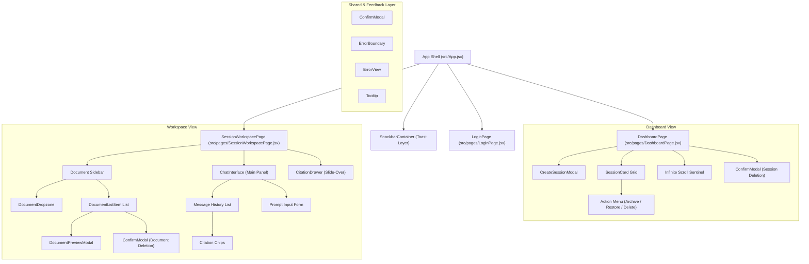
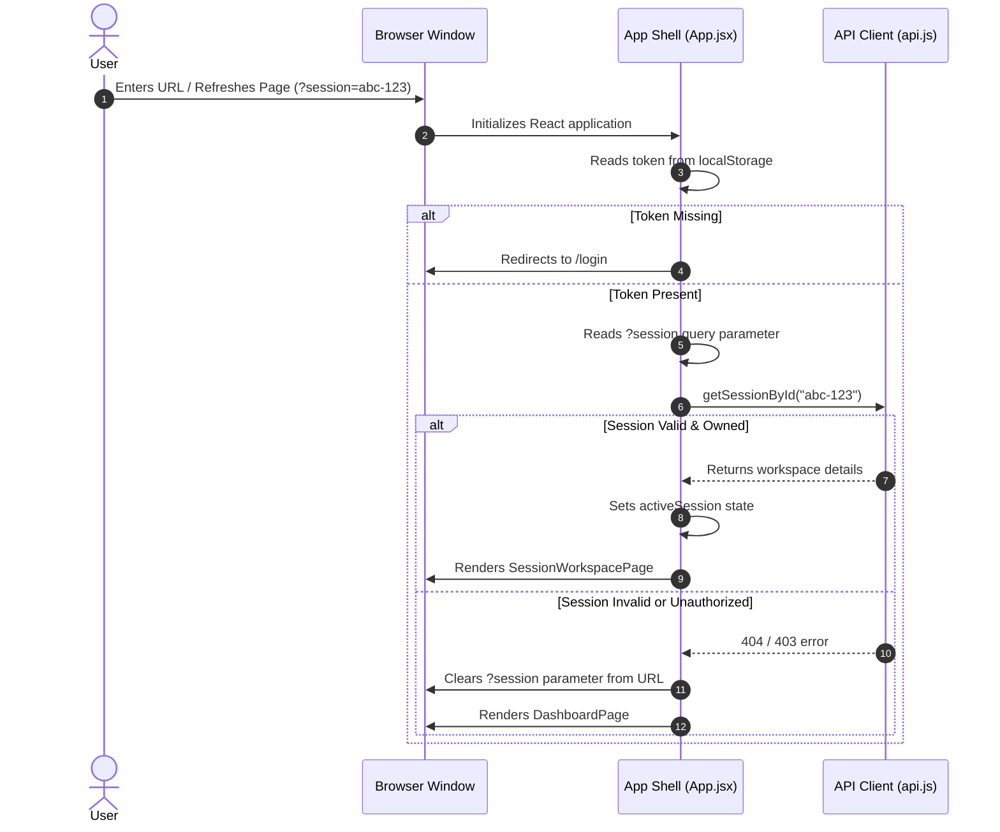
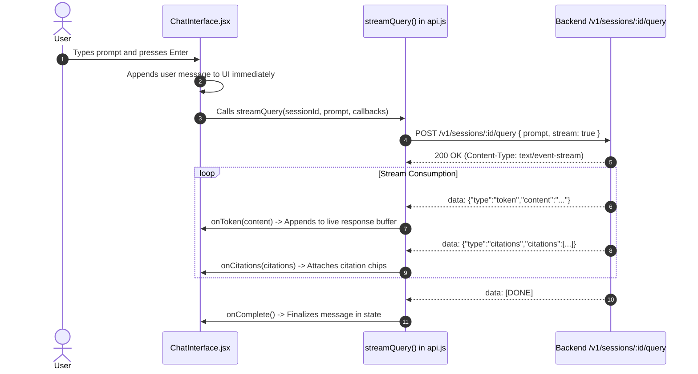

# Frontend Technical Requirements Document (FE TRD)
## PageSense: Document Intelligence & Query System

---

## 1. System Overview & Objectives

The Frontend application serves as the client-side presentation and interaction layer for the **Document Intelligence & Query System**. It provides an intuitive, high-performance interface for knowledge workers to manage topic-based workspaces, upload and monitor multi-format documents, and conduct conversational question-answering with real-time streaming and verifiable citations.

### Core Architectural Objectives
1. **Single-Page Application (SPA) Responsiveness**: Provide instantaneous transitions between the workspace dashboard and document workspaces without full-page reloads.
2. **Real-Time Token Streaming**: Consume and render Server-Sent Events (SSE) token-by-token with typewriter-style responsiveness and zero UI stutter.
3. **Robust State Persistence & URL Synchronization**: Ensure active workspaces and filters remain synchronized with the browser address bar, enabling seamless state restoration across page reloads and browser navigation.
4. **Resilient Asynchronous Ingestion Monitoring**: Automatically track background document parsing and embedding workflows through polling loops that cleanly start and stop based on document lifecycle states.
5. **Polished, Accessible Dark-Theme UX**: Deliver a modern visual interface utilizing deep slate palettes, non-blocking toast notifications, and styled in-app confirmation modals.

---

## 2. Technology Stack & Architectural Evaluation

| Layer / Concern | Technology | Selection Rationale & Architectural Criteria |
| :--- | :--- | :--- |
| **Runtime & UI Library** | **React 19** | Component-driven declarative architecture, optimized virtual DOM reconciliation, and modern hook lifecycle management (`useState`, `useEffect`, `useRef`, `useCallback`). |
| **Build Tool & Bundler** | **Vite 8** | Native ECMAScript Modules (ESM) development server for instantaneous startup, fast Hot Module Replacement (HMR), and Rollup-based production minification. |
| **Styling & Design System** | **Tailwind CSS v4** (`@tailwindcss/vite`) | Utility-first CSS compiler integrated into the Vite build pipeline, zero-runtime overhead, and standardized dark palette (`slate-950` / `slate-900`). |
| **Iconography** | **lucide-react** | Tree-shakeable SVG icon suite offering consistent visual aesthetics and minimal bundle footprint. |
| **File Drag-and-Drop** | **react-dropzone** | HTML5 file drag-and-drop handling with client-side MIME-type validation, multi-file queuing, and size enforcement. |
| **Markdown & Formatting** | **react-markdown** + **remark-gfm** | Safe rendering of AI responses including bold typography, lists, code syntax, and GitHub-Flavored Markdown tables without injecting unescaped HTML. |
| **Network & Streaming** | **Fetch API** + **Streams API** | Native `ReadableStreamDefaultReader` for chunked Server-Sent Events (SSE) decoding without requiring external heavyweight socket libraries. |

---

## 3. Client Architecture & Component Hierarchy

### 3.1 Architectural Component Tree

### 3.2 Component Inventory & Specifications

#### 1. App Shell (`src/App.jsx`)
- **Role**: Root coordinator of user authentication, active workspace selection, browser history synchronization, and top-level routing.
- **State Managed**: `user`, `activeSession`, `initializing`.
- **Key Responsibilities**:
  - Validates authentication token in local storage on startup.
  - Inspects URL query parameters (`?session=<id>`) or path patterns (`/session/<id>`) to restore active workspaces upon page reload.
  - Listens for browser `popstate` events to navigate forward/backward between workspaces and the dashboard.
  - Subscribes to global authentication events (`auth:unauthorized`) to purge state and redirect to the login screen.

#### 2. Authentication View (`src/pages/LoginPage.jsx`)
- **Role**: Presents user authentication forms with toggling between Sign In and Create Account modes.
- **Key Responsibilities**:
  - Collects and validates email, password, and full name.
  - Calls authentication service endpoints and dispatches the authenticated user profile to the parent shell.
  - Displays validation errors via non-blocking snackbars.

#### 3. Dashboard View (`src/pages/DashboardPage.jsx`)
- **Role**: Primary management console for personal workspaces.
- **Key Responsibilities**:
  - Manages active vs. archived tab filtering, search term debouncing, and cursor-based pagination.
  - Renders workspace cards in a responsive grid.
  - Implements an `IntersectionObserver` sentinel to trigger next-page fetches.
  - Coordinates workspace creation modals and soft-deletion confirmation dialogs.

#### 4. Workspace View (`src/pages/SessionWorkspacePage.jsx`)
- **Role**: Dual-pane workspace organizing documents and conversational chat.
- **Key Responsibilities**:
  - Hosts the left-hand document sidebar and the central conversational chat panel.
  - Manages real-time polling for in-flight document processing jobs.
  - Coordinates the slide-over citation inspection drawer and document preview modals.
  - Detects archived state (`session.status === 'ARCHIVED'`) to enforce read-only presentation: hides the document upload dropzone, disables retry controls, styles the status pill with an amber tone, and coordinates in-workspace session restoration via `onSessionUpdate`.

#### 5. Document Dropzone (`src/components/workspace/DocumentDropzone.jsx`)
- **Role**: Drag-and-drop file ingestion zone.
- **Key Responsibilities**:
  - Enforces client-side validation using configurable thresholds (initial defaults: max 10 MB per file, max 10 files per batch) along with allowed MIME types (PDF, DOCX, TXT, common image formats).
  - Displays visual validation alerts when limits or file types are violated.
  - Emits selected files to the parent upload handler with instant visual drop feedback.
  - Automatically hidden in archived workspaces to prevent file uploads.

#### 6. Document List Item (`src/components/workspace/DocumentListItem.jsx`)
- **Role**: Displays individual file metadata and ingestion status.
- **Key Responsibilities**:
  - Renders document title, size, page count, and status badge (`Queued`, `Processing`, `Ready`, `Failed`).
  - Displays animated spinners during active parsing and embedding.
  - Provides actions to preview content, download original files, retry failed processing, or trigger deletion (in archived sessions, retry is disabled while preview, download, and deletion remain active).

#### 7. Chat Interface (`src/components/workspace/ChatInterface.jsx`)
- **Role**: Conversational interaction area for natural language queries.
- **Key Responsibilities**:
  - Displays scrollable message history with distinct user and assistant speech bubbles.
  - Renders streaming responses token-by-token with automatic downward scrolling.
  - Parses and renders Markdown structures (tables, code blocks, bullet lists).
  - Renders interactive citation chips that trigger the citation drawer upon click.
  - Provides a prompt retry button for interrupted or failed queries.
  - Enforces archived state behavior: replaces the prompt input box with an amber archived banner ("This session is archived. Restore it to upload documents or ask questions.") featuring a direct "Restore Session" action button, and suppresses keyboard auto-focus shortcuts when archived.

#### 8. Citation Drawer (`src/components/workspace/CitationDrawer.jsx`)
- **Role**: Slide-over panel for verifying AI response grounds.
- **Key Responsibilities**:
  - Displays source document name, exact page reference, similarity score, and full extracted text snippet.
  - Offers a one-click button to view the original file via a secure cloud storage link.

#### 9. Document Preview Modal (`src/components/workspace/DocumentPreviewModal.jsx`)
- **Role**: In-app viewer for document summaries and extracted text snippets.
- **Key Responsibilities**:
  - Renders document metadata, AI-generated summary, and extracted text buffer with truncation indicators for large files.

#### 10. Confirmation Modal (`src/components/common/ConfirmModal.jsx`)
- **Role**: In-app dialog for confirming destructive operations (deleting sessions, deleting documents).
- **Key Responsibilities**:
  - Displays a themed dark overlay with customizable title, warning message, and confirm/cancel buttons.
  - Replaces native browser alert and confirm popups.

#### 11. Snackbar Container (`src/components/SnackbarContainer.jsx`)
- **Role**: Global notification manager for application feedback.
- **Key Responsibilities**:
  - Renders dismissible toasts for error, warning, and success notifications.
  - Automatically clears notifications after a timed delay.

---

## 4. State Management & Lifecycle Architecture

### 4.1 State Classification & Strategy

| State Category | Scope | Persistence Mechanism | Description |
| :--- | :--- | :--- | :--- |
| **Authentication State** | Global | `localStorage` (`token`, `user`) | JWT token string and user identity object; cleared on logout or 401 response. |
| **Navigation & Session State** | Global | URL Parameters + `localStorage` | Active workspace ID (`?session=<id>`) and dashboard tab (`?tab=<filter>`); restores active view on browser reload. |
| **Workspace List State** | Dashboard | Component State (`useState`) | Array of workspace objects, pagination cursor, hasMore boolean, and active search term. |
| **Document Pipeline State** | Workspace | Component State (`useState`) + Polling | Document metadata array, active uploading flag, and polling interval reference. |
| **Chat & Streaming State** | Workspace | Component State + `useRef` | Conversation message history, real-time token accumulation buffer, active streaming flag, and prompt retry cache. |
| **Inspection State** | Workspace | Component State (`useState`) | Active citation object for drawer display; active document object for preview modal. |

### 4.2 Browser Navigation & Page Reload State Recovery

---

## 5. Network, Streaming & Communication Layer

### 5.1 API Client Design (`src/services/api.js`)
- **Base URL Resolution**: Defaults to relative `/v1` endpoint in local development (proxied by Vite) or configurable environment variable (`VITE_API_BASE_URL`).
- **Authorization Injection**: Automatically attaches `Authorization: Bearer <token>` to all protected outgoing HTTP requests.
- **Centralized Response Interception**:
  - Unwraps the standard backend envelope structure (`{ status, message, response }`).
  - Intercepts HTTP 401 Unauthorized responses, triggers global session cleanup, and emits `auth:unauthorized` events.
  - Catches network failure exceptions and triggers user-facing error snackbars.

### 5.2 Server-Sent Events (SSE) Streaming Protocol
The client implements native stream processing using `fetch` combined with `ReadableStreamDefaultReader`:

### 5.3 Asynchronous Document Polling Loop
- **Trigger**: Activated when the document list contains any document with status `QUEUED` or `PROCESSING`.
- **Interval**: Executes every 3,000 milliseconds (3 seconds).
- **Termination Conditions**:
  - All documents transition into terminal states (`READY` or `FAILED`).
  - The user navigates away from the workspace (clean component unmount clearing the timer).
  - Explicit document deletion or workspace change.

---

## 6. UI/UX Specifications & Design System

### 6.1 Color Palette & Visual Tokens
- **Background**: Deep Slate (`slate-950` / `#020617`) for minimized eye strain during extensive reading.
- **Panels & Cards**: Elevated Slate (`slate-900` / `#0f172a`) with subtle borders (`slate-800` / `#1e293b`).
- **Primary Accents**: Vibrant Indigo (`indigo-500` / `#6366f1` and `indigo-600` / `#4f46e5`) for buttons, focus rings, and active tab indicators.
- **Status Indicators**:
  - `Queued`: Cool Gray (`slate-400` / `#94a3b8`)
  - `Processing`: Amber / Indigo Pulsing Badge (`amber-400` / `#fbbf24`)
  - `Ready`: Emerald Check (`emerald-400` / `#34d399`)
  - `Failed`: Rose Warning (`rose-400` / `#fb7185`)

### 6.2 Layout Breakpoints & Ergonomics
- **Dashboard Grid**: Responsive layout spanning 1 column on mobile (`< 640px`), 2 columns on tablets (`>= 640px`), and 3 columns on desktops (`>= 1024px`).
- **Workspace Layout**:
  - Left Sidebar: Fixed width (340px) on desktop, collapsible on smaller viewports.
  - Central Panel: Flex-grow conversational feed with auto-scrolling pinned to new content.
  - Slide-Over Drawer: 420px width sliding in from the right edge with a backdrop blur.

### 6.3 User Feedback Standards
- **Destructive Confirmations**: All deletions (workspaces, documents) require confirmation through `ConfirmModal`. Native browser alert/confirm dialogues are strictly prohibited.
- **Operational Notifications**: Asynchronous events (failed uploads, network timeouts, copy confirmations) render through `SnackbarContainer` at the bottom-right of the viewport.

---

## 7. Performance, Security & Optimization

### 7.1 Performance Optimizations
- **Cursor-Based Infinite Scrolling**: Uses `IntersectionObserver` on a bottom sentinel element rather than scroll event listeners, preventing layout thrashing during dashboard browsing.
- **Stream Buffer Flushing**: Incremental token updates during AI streaming are batched to animation frames, preventing unnecessary virtual DOM re-renders.
- **Resource Cleanup**: All timers, event listeners, and stream readers are explicitly aborted and cleaned during component unmount cycles to prevent memory leaks.

### 7.2 Security Considerations
- **Content Sanitization**: Markdown rendering uses strict AST parsing via `react-markdown` without raw HTML injection (`rehype-raw` is excluded), mitigating Cross-Site Scripting (XSS) risks from untrusted document content.
- **Credential Storage**: Authentication tokens are maintained in `localStorage` and scrubbed immediately upon session expiration or explicit sign-out.
- **Presigned URL Isolation**: Original document viewing URLs are generated with short-lived presigned credentials, preventing persistent unauthorized asset sharing.

---

## 8. Build, Environment & Proxy Architecture

### 8.1 Environment Variables & Client Configuration
| Variable Name | Required | Default | Purpose |
| :--- | :--- | :--- | :--- |
| `VITE_API_BASE_URL` | Optional | `/v1` | Base URL prefix for backend REST and streaming endpoints. |
| `VITE_MAX_FILE_SIZE_MB` | Optional | `10` | Initial default maximum file size in megabytes (configurable). |
| `VITE_MAX_BATCH_FILES` | Optional | `10` | Initial default maximum file count per upload batch (configurable). |

### 8.2 Development Proxy Configuration
In local development, the Vite development server proxies requests matching the `/v1` prefix to the backend application server running on port 3000, eliminating Cross-Origin Resource Sharing (CORS) friction during development while mirroring production path structures.
