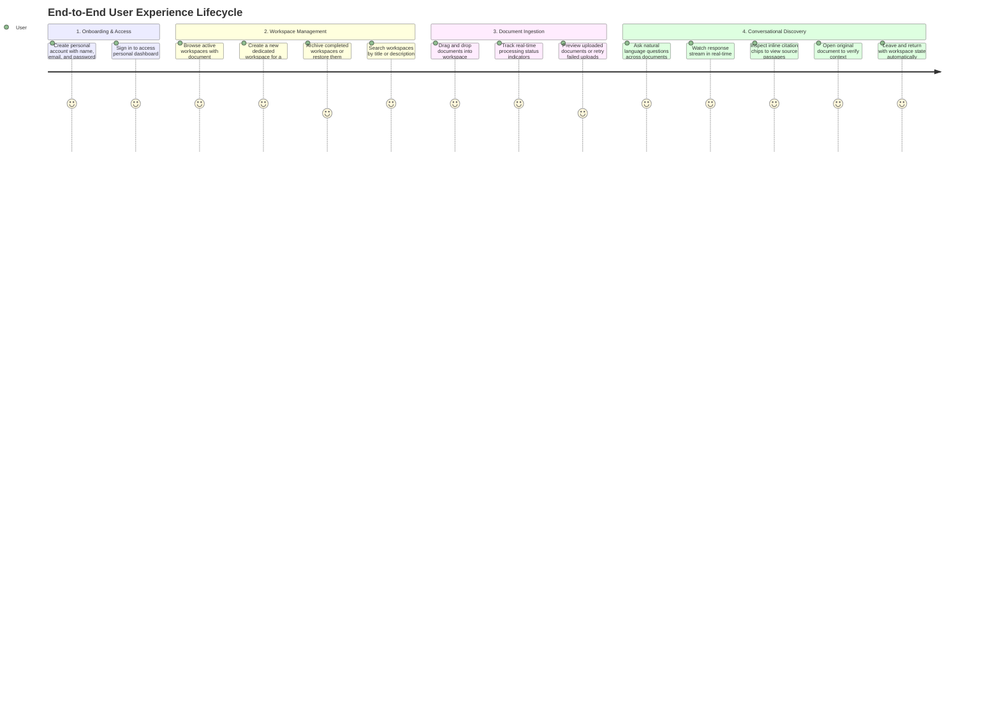

# Product Requirements Document (PRD)
## PageSense: Document Intelligence & Query System

---

## 1. Executive Summary & Vision

Students, researchers, product analysts, and writers deal with large volumes of unstructured and semi-structured documents daily, including academic papers, market reports, customer interview notes, books, articles, and guidelines. The valuable information trapped within these files is difficult to locate quickly, synthesize across sources, or query conversationally.

The **Document Intelligence & Query System** transforms static, unstructured documents into an interactive, structured, and conversational knowledge base. Users create dedicated topic-based workspaces, upload multiple documents in diverse formats, and instantly ask natural-language questions. The system delivers synthesized answers with pinpoint citations referencing exact source pages and passages, allowing users to verify facts with zero friction while maintaining strict confidentiality and workspace isolation.

---

## 2. Problem Statement & Opportunity

### 2.1 The Problem
- **Information Overload & Silos**: Critical ideas and research findings are locked in disparate document formats (PDFs, Word documents, text files, scanned notes) across personal folders.
- **Time-Consuming Skimming**: Reviewing multi-page literature reviews, whitepapers, or interview transcripts requires hours of manual skimming and keyword searching that fails to grasp thematic meaning.
- **Lack of Verification in AI**: Traditional AI chat systems frequently hallucinate information or fail to provide verifiable source references, making them unhelpful when writing papers, reports, or articles that require source attribution.
- **Context Loss**: Existing tools do not provide organized workspaces where multiple related research files can be analyzed together while preserving context across browser sessions.

### 2.2 The Product Opportunity
By combining automated text extraction, intelligent contextual search, and conversational artificial intelligence with verifiable source citations, this system provides users with an authoritative "second brain" for their reading and research.

---

## 3. Target Personas

### Persona 1: Students & Academic Researchers
- **Role**: University students, graduate researchers, professors, and thesis writers.
- **Pain Point**: Reading dozens of 30-50 page research papers, literature reviews, and textbook chapters for assignments and dissertations.
- **Goal**: Ask thematic questions across multiple papers, compare hypotheses, and receive syntheses with clickable page-level citations for their bibliography.

### Persona 2: Product Managers & Market Analysts
- **Role**: Product managers, UX researchers, strategy analysts, and consultants.
- **Pain Point**: Sifting through competitor whitepapers, customer interview transcripts, product requirements, and industry reports.
- **Goal**: Synthesize recurring customer pain points and market trends across multiple documents into clear, actionable summaries.

### Persona 3: Content Creators, Writers & Journalists
- **Role**: Non-fiction authors, technical bloggers, journalists, and newsletter writers.
- **Pain Point**: Gathering and verifying facts across extensive research dossiers, interview notes, and public reports.
- **Goal**: Quickly locate exact quotes, cross-reference source materials, and verify historical or thematic facts with direct page links.

---

## 4. User Journey & Core Workflows

---

## 5. Functional Requirements

### 5.1 Account & Identity Management
- **User Registration**: New users can register with their full name, email address, and a secure password.
- **User Authentication**: Secure login screen allowing registered users to sign in.
- **Personal Workspace Isolation**: Every user operates within an isolated environment. Users can never view, search, or access another user's workspaces, files, or chat histories.
- **Session Continuity**: Returning users remain signed in across page refreshes and browser sessions until they explicitly sign out.

### 5.2 Workspace Management (Dashboard)
- **Workspace Dashboard**: A clean home dashboard presenting all user-owned workspaces in an organized grid.
- **Status Filtering**: Tabbed navigation to switch between **Active Workspaces** and **Archived Workspaces**.
- **Search & Filtering**: Real-time search bar allowing users to filter workspaces by title or description.
- **Workspace Cards**: Each workspace card displays:
  - Workspace title and optional description
  - Total number of uploaded documents
  - Last activity and updated timestamp
  - Quick action menu for archiving, restoring, or deleting
- **Workspace Creation**: A modal dialog allowing users to name a new workspace and add an optional description.
- **Archive & Restore**: Users can archive inactive workspaces to declutter their dashboard, with the ability to restore them at any time (from the dashboard card or directly within the workspace).
- **Archived Workspace Read-Only Enforcement**:
  - When accessing an archived workspace, the workspace operates in read-only mode: document uploads, document retries, and conversational query options are disabled.
  - Document viewing, downloading original files, inspecting citations, message history review, and document deletion remain accessible.
  - In the chat area, the typing prompt box is replaced with an informative banner indicating that the session is archived, accompanied by a direct "Restore Session" action button to reactivate the workspace.
- **Workspace Deletion**: Users can delete a workspace via a styled in-app confirmation dialog. Deleting a workspace removes it and its documents from active search without affecting cloud backups.
- **Seamless State Resume**: When a user selects a workspace, the workspace ID is reflected in the URL. If the user refreshes their browser or shares their own workspace URL across tabs, the workspace is immediately restored without returning to the dashboard.

### 5.3 Document Ingestion & Management
- **Drag-and-Drop Ingestion**: An intuitive dropzone allowing users to drag and drop files or browse their computer.
- **Supported Document Formats**:
  - Portable Document Format (PDF)
  - Microsoft Word Documents (DOCX)
  - Plain Text & Markdown (TXT, MD, MARKDOWN)
  - Tabular & Structured Data (CSV, TSV, JSON, XML, YAML, YML)
  - Web Markup & Server Logs (HTML, HTM, LOG)
  - Scanned Documents and Images (PNG, JPEG, JPG, WebP, BMP, TIFF)
  - *(Excludes executable code files like .py, .js, .ts, .sh, .sql)*
- **Ingestion Limits**:
  - File size: Up to 10 MB per file (initial default, configurable)
  - Batch upload: Up to 5 files per upload action (initial default, configurable)
  - Visual validation alerts displayed when limits are exceeded
- **Dropzone Interaction Isolation**: Key press events on the upload dropzone are suppressed to avoid accidental file-picker dialog re-openings during keyboard-driven navigation.
- **Real-Time Processing Status**: Each document displays its current ingestion status:
  - **Queued**: Document received and awaiting processing
  - **Processing**: Document text, layout, and structure being analyzed
  - **Ready**: Document fully indexed and available for querying
  - **Failed**: Ingestion error with an option to retry
- **Document List View**: Displays filename, file size, detected page count, and status badge.
- **Document Failure & Retry**: One-click action on failed documents to retry processing without re-uploading the file.
- **Document Preview & Download**:
  - In-app preview displaying an AI-generated short summary (2-3 sentences) capturing core takeaways.
  - Graceful content rendering across file types (text preview with smart truncation for large files, metadata fallback for binaries).
  - Direct download button to retrieve the original uploaded file.
- **Document Removal**: Ability to delete individual documents from the workspace with a confirmation prompt.

### 5.4 Conversational Q&A & Document Intelligence
- **Natural Language Chat**: A conversational input field where users can ask questions in plain language regarding any or all documents in the active workspace.
- **Ambient Typing Auto-Focus & Enter Key Dispatch**:
  - Typing anywhere within the active workspace naturally routes keystrokes into the query input box without dropping the first character.
  - When text is already present in the prompt box, pressing the <kbd>Enter</kbd> key anywhere in the workspace immediately sends the query, clears the input, and re-focuses for rapid conversation flow.
- **Real-Time Streaming Responses**: Answers appear progressively with a responsive streaming animation as they are generated.
- **Multi-Document Synthesis**: The system answers questions by synthesizing information across multiple documents within the workspace using contextual embeddings (where document-level summaries ground segmented chunk vectors).
- **Multi-Turn Conversational Memory**:
  - The query engine retains a sliding context window of past messages (configurable default: 6 messages), allowing users to ask natural follow-up questions without re-explaining context.
- **Inline Source Citations**:
  - Generated answers include numbered citation chips (e.g., `[1] Contract.pdf (p. 4)`).
  - Clicking any citation chip opens a slide-over inspection drawer.
- **Source Inspection Drawer**:
  - Displays the exact passage, source document name, and page number referenced by the citation.
  - Provides a direct link to preview or open the original document.
- **Chat History & Seamless Navigation**:
  - Full conversation history is retained within the workspace so users can review previous inquiries and responses.
  - Recent messages load immediately upon opening a workspace, with older messages fetched seamlessly as the user scrolls up.
- **Prompt Retry**: Option to retry an unanswered or interrupted prompt directly from the conversation thread.

### 5.5 Notifications & User Feedback
- **In-App Confirmations**: Styled dialogs for destructive actions (e.g., deleting a workspace or document), avoiding native browser alerts.
- **Non-Blocking Toast Notifications**: Clear, dismissible toast notifications for system alerts, network disconnections/reconnections, session expiration/re-authentication prompts, file validation failures, and operational successes.

---

## 6. Non-Functional Requirements

### 6.1 Usability & User Experience
- Modern, high-contrast dark theme designed for extended research sessions.
- Clear visual hierarchy with responsive feedback for all user actions.
- Zero manual document configuration required; all formatting, text extraction, and indexing happen automatically.

### 6.2 Performance & Responsiveness
- **Document Ingestion**: Single-page documents ready for search within 15 seconds; multi-page documents within 45 seconds.
- **Conversational Latency**: Initial response tokens begin streaming within 3 seconds of question submission.
- **Workspace Navigation**: Instant switching between dashboard and workspace views.

### 6.3 Security & Data Privacy
- **Strict Tenant Isolation**: Complete logical separation between users; no user can access or infer data from another user's workspaces or documents.
- **Data Protection at Rest & in Transit**: All user data, credentials, and uploaded files are protected with industry-standard encryption.
- **Verifiable Answers**: Every AI answer must cite traceable excerpts from the user's uploaded documents to prevent inaccurate information.

### 6.4 Reliability & Resilience
- Graceful handling of network interruptions with automatic session state recovery.
- Resilient document ingestion with retry capabilities for transient processing failures.
- **Multi-Provider AI Resilience**: Zero-downtime conversational query and summary fallbacks across a redundant provider chain (Google Gemini, Groq high-speed inference, and OpenAI), ensuring continuity even during third-party rate limits or vendor service outages.

---

## 7. Product Boundaries & Future Roadmap

### 7.1 In Scope for Version 1
- Single-user workspace authentication and personal management.
- Multi-document upload (PDF, DOCX, TXT, MD, CSV, TSV, JSON, XML, HTML, YAML, LOG, and images) with configurable thresholds (initial defaults: up to 10 MB per file, max 5 files per batch).
- Real-time document status tracking with one-click retry on ingestion failure.
- In-app document preview with AI-generated executive summaries, graceful multi-format rendering, and original file download option.
- Conversational querying with real-time answer streaming powered by a resilient multi-provider AI chain (Gemini, Groq, OpenAI).
- Exact inline citations, source passage inspection drawer, and document verification.
- Workspace archiving, restoring, and deletion with state preservation across browser refreshes.

### 7.2 Future Enhancements
- Multi-user real-time collaboration and workspace sharing.
- Audio and video file transcription and ingestion.
- Direct cloud storage integrations (Google Drive, Microsoft OneDrive, Dropbox).
- Automated export of conversations to PDF or presentation slides.
- Custom tagging, labeling, and folder hierarchies within workspaces.
