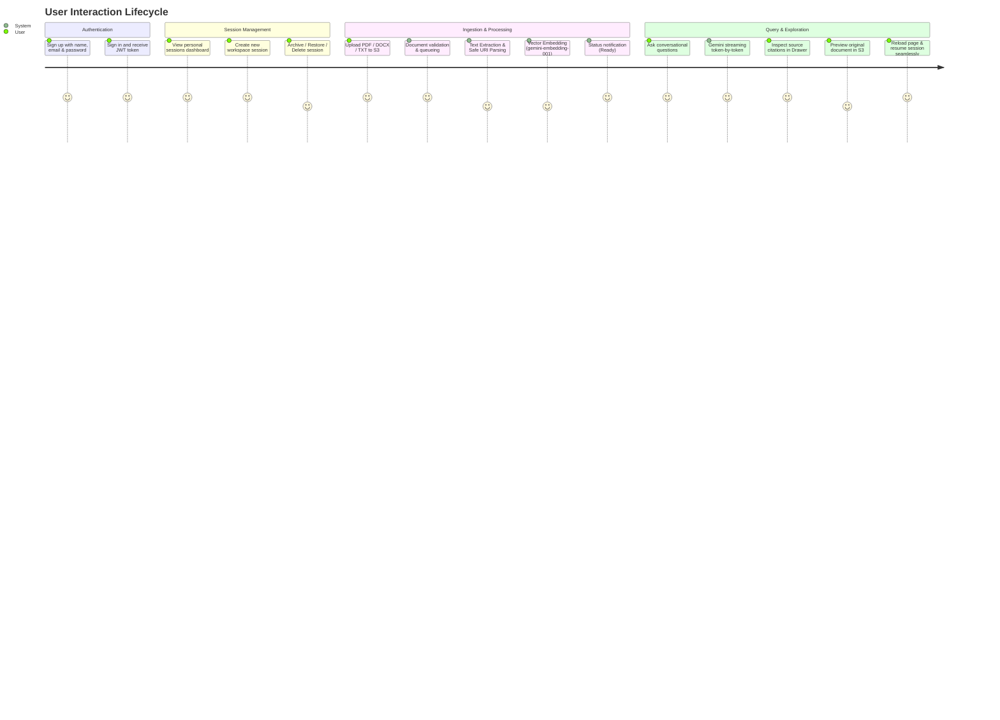

# Product Requirements Document (PRD)
## Document Intelligence & Query System: "From Messy Documents to Structured, Queryable Data"

---

## 1. Executive Summary & Vision

Organizations and individuals deal with a deluge of unstructured and semi-structured documents (scanned PDFs, Word files, receipts, contracts, reports, plain text). Valuable business insights remain trapped within these files because they are not easily searchable, relational, or conversational.

This product is an end-to-end web application that ingests unstructured and semi-structured documents, applies automated parsing, OCR, chunking, and extraction, and converts them into structured, queryable, and conversational data. Users interact with their documents via isolated, user-authenticated workspaces (sessions), leveraging hybrid search and an AI-powered conversational Q&A interface with source citations.

---

## 2. Core Objectives & Success Metrics

### Objectives
1. **User Authentication & Tenant Isolation**: Secure user registration and login with email/password via JWT Bearer authentication. All workspaces, documents, and vectors are strictly scoped to the owner to prevent IDOR access.
2. **Seamless Document Ingestion**: Upload various document formats (`.pdf`, `.docx`, `.txt`, images/scans) with zero manual formatting needed, stored securely in AWS S3.
3. **Robust Extraction & Structuring**: Automate OCR and text/metadata extraction, breaking complex documents into structured entities, chunks, and vector embeddings.
4. **Session-based Organization**: Provide workspace isolation where documents belong to specific projects/topics (sessions), with full lifecycle control (create, archive, restore, delete with custom in-app confirmation modals).
5. **Interactive Query & Chat Interface**: Allow natural language questions and search queries with pinpoint citations (page numbers, text references), powered by Google Gemini.
6. **State Persistence**: Preserve active session workspace across page reloads and browser navigation without losing context.

### Key Performance Indicators (KPIs)
- **Processing Time**: < 15 seconds for single-page documents; < 45 seconds for a 20-page PDF.
- **Extraction Accuracy**: High-fidelity OCR and text extraction retaining document layout hierarchy.
- **Search & Response Latency**: < 2 seconds for search results; < 3 seconds for first-token streaming in conversational Q&A.
- **Citation Precision**: 100% of LLM answers supported by traceable document source snippets.
- **Security**: 0% unauthorized cross-user data leakage (strict IDOR enforcement across all API endpoints).

---

## 3. Target Personas

1. **Knowledge Worker / Analyst**: Needs to cross-reference multiple policy documents, whitepapers, or quarterly reports quickly.
2. **Operations & Finance Personnel**: Deals with invoices, purchase orders, statements, and forms needing structured field lookup.
3. **Legal / Compliance Auditor**: Reviews contracts, identifying specific clauses, terms, and obligations across document versions.

---

## 4. User Journey & Core Workflows

---

## 5. Functional Requirements

### 5.1. Authentication & User Management
- **FR-1.1 Email Registration & Login**: Users register with full name, email, and password (hashed with bcrypt). Returns a signed JWT.
- **FR-1.2 Bearer Authentication**: Middleware validates tokens for all data endpoints. Unauthenticated requests are rejected with 401 Unauthorized.
- **FR-1.3 User Scoping & IDOR Prevention**: Every session, document, chunk, and message is stamped with `userId`. Database queries strictly check `{ id, userId }` to guarantee complete tenant isolation.

### 5.2. Session Management (Home Dashboard)
- **FR-2.1 Session Listing & Cursor-Based Pagination**:
  - Display cards of user-owned active and archived sessions showing title, document count, and relative timestamps.
  - Efficient cursor-based infinite scrolling on the frontend with a modern circular loader.
  - Compound cursor `(updatedAt, _id)` query execution on the backend ensuring stable pagination without duplicate or skipped items.
  - Server-side search filtering across session title and description.
- **FR-2.2 Create Session**: Modal action to create a named session with an optional description.
- **FR-2.3 Archive / Restore**: Ability to archive sessions to keep the dashboard clean, with instant restore.
- **FR-2.4 Soft Delete Session (In-App Modal)**: Delete session with a custom dark UI confirmation dialog. Performs cascading soft delete (`isDeleted: true`, `deletedAt`) across MongoDB sessions, documents, chunks, and chat messages while preserving underlying S3 assets.
- **FR-2.5 Session Resume Across Reloads**: Selecting a session syncs the URL (`?session=<id>`). Browser page reloads automatically restore the active workspace.

### 5.3. Document Ingestion & Pipeline Processing
- **FR-3.1 Upload Limits & File Handling**:
  - Drag-and-drop dropzone supporting `.pdf`, `.docx`, `.txt`, `.png`, `.jpeg`, `.webp`, `.bmp`, `.tiff`.
  - Max file size: 1 MB per file; max upload count: 4 files per batch.
  - User-friendly backend error responses with dedicated frontend snackbar notifications (replacing modal browser alerts).
- **FR-3.2 Processing Pipeline & SQS Queuing**:
  - **Stage 1: S3 Upload**: Streamed raw file upload to AWS S3 (`ap-south-1`).
  - **Stage 2: Asynchronous Job Queuing**: Jobs dispatched to AWS SQS queue (`document_processing_queue_local`) and processed by an isolated consumer worker.
  - **Stage 3: Safe Parsing**: Page-level PDF extraction via `pdf2json` with malformed URI recovery; DOCX parsing via `mammoth`; cooperative event-loop yielding (`setImmediate`) to keep the Node.js event loop unblocked.
  - **Stage 4: Chunking & Vectorization**: Semantic chunking (~1200 chars, 200 overlap, capped per file) and embeddings via `gemini-embedding-001`.
- **FR-3.3 Ingestion Status Tracking**: Real-time status badges for each document: `Queued` ➔ `Processing` (auto-polled every 3s) ➔ `Ready` or `Failed`.

### 5.4. Query & Exploration Interfaces
- **FR-4.1 Conversational Chat Interface**:
  - Natural language querying across all documents within the session.
  - Streaming responses powered by Gemini API with multi-model fallback cascade (`gemini-2.5-flash` / `gemini-2.5-flash-lite`) to handle service capacity.
  - Retry failed or unanswered prompts directly from the chat interface.
  - Inline source citations showing document name, page number, and snippet preview on click.
- **FR-4.2 Citation Drawer & Document Viewer**:
  - Slide-over drawer displaying exact source text and page reference.
  - One-click button to open/download the original file via presigned S3 URL.

---

## 6. Non-Functional Requirements

### 6.1. Security & Privacy
- Zero cross-tenant data leakage (strict IDOR enforcement across all CRUD and vector retrieval queries).
- Password hashing with bcrypt salt rounds = 10.
- JWT tokens signed with expiration and validated at the middleware layer.
- Encrypted AWS S3 document storage at rest and in transit.

### 6.2. Performance & Scalability
- Asynchronous SQS worker processing so file uploads and CPU-heavy text extraction never block Express HTTP threads.
- Cursor-based database queries using compound indexed keys `(userId, status, isDeleted, updatedAt, _id)`.
- Vector search cosine similarity retrieval < 300ms.
- Fast token-by-token streaming with multi-model Gemini fallback.

---

## 7. Out of Scope for v1 (Future Scope)
- Multi-user real-time collaboration within a single session.
- Third-party cloud drive connectors (Google Drive, Dropbox).
- Audio/video transcription ingestion.
