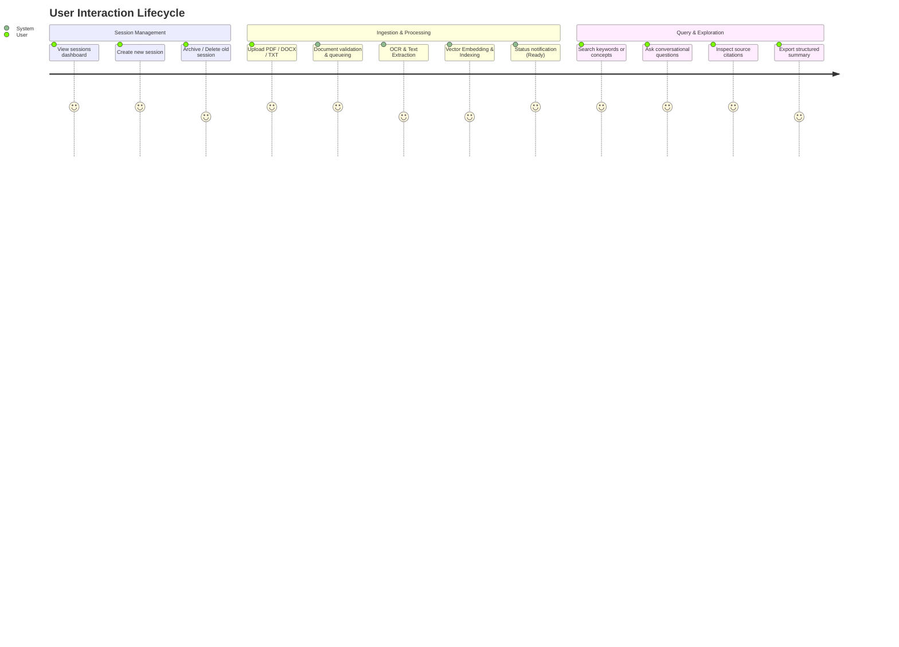

# Product Requirements Document (PRD)
## Document Intelligence & Query System: "From Messy Documents to Structured, Queryable Data"

---

## 1. Executive Summary & Vision

Organizations and individuals deal with a deluge of unstructured and semi-structured documents (scanned PDFs, Word files, receipts, contracts, reports, plain text). Valuable business insights remain trapped within these files because they are not easily searchable, relational, or conversational.

This product is an end-to-end web application that ingests unstructured and semi-structured documents, applies automated parsing, OCR, chunking, and extraction, and converts them into structured, queryable, and conversational data. Users interact with their documents via sessions, leveraging hybrid search (keyword + semantic vector) and an AI-powered conversational Q&A interface with source citations.

---

## 2. Core Objectives & Success Metrics

### Objectives
1. **Seamless Document Ingestion**: Upload various document formats (`.pdf`, `.docx`, `.txt`, images/scans) with zero manual formatting needed.
2. **Robust Extraction & Structuring**: Automate OCR and text/metadata extraction, breaking complex documents into structured entities, chunks, and metadata.
3. **Session-based Organization**: Provide workspace isolation where documents belong to specific projects/topics (sessions), with full lifecycle control (create, archive, restore, delete).
4. **Interactive Query & Chat Interface**: Allow natural language questions, structured attribute filters, and search queries with pinpoint citations (page numbers, text references).

### Key Performance Indicators (KPIs)
- **Processing Time**: < 15 seconds for single-page documents; < 45 seconds for a 20-page PDF.
- **Extraction Accuracy**: High-fidelity OCR and text extraction retaining document layout hierarchy (headings, tables, paragraphs).
- **Search & Response Latency**: < 2 seconds for search results; < 3 seconds for first-token streaming in conversational Q&A.
- **Citation Precision**: 100% of LLM answers supported by traceable document source snippets.

---

## 3. Target Personas

1. **Knowledge Worker / Analyst**: Needs to cross-reference multiple policy documents, whitepapers, or quarterly reports quickly.
2. **Operations & Finance Personnel**: Deals with invoices, purchase orders, statements, and forms needing structured field lookup.
3. **Legal / Compliance Auditor**: Reviews contracts, identifying specific clauses, terms, and obligations across document versions.

---

## 4. User Journey & Core Workflows

---

## 5. Functional Requirements

### 5.1. Session Management (Home Dashboard)
- **FR-1.1 Session Listing**: Display cards/tables of all active sessions showing title, document count, creation date, and last accessed timestamp.
- **FR-1.2 Create Session**: Modal or inline action to create a named session with an optional description and category/tags.
- **FR-1.3 Archive / Unarchive**: Ability to archive sessions to keep the active dashboard clean without permanently deleting data.
- **FR-1.4 Delete Session**: Hard or soft delete session with confirmation prompt (cascading cleanup of associated files and embeddings).
- **FR-1.5 Session Resume**: Clicking on any session loads the complete state: document inventory, processing statuses, and historical chat/query threads.

### 5.2. Document Ingestion & Pipeline Processing
- **FR-2.1 Multi-format Upload**: Support file dropzone for:
  - Portable Document Format (`.pdf`, including scanned/image-based PDFs)
  - Microsoft Word (`.docx`)
  - Plain Text & Markdown (`.txt`, `.md`)
  - Scanned images (`.png`, `.jpg`, `.tiff`)
- **FR-2.2 Processing Pipeline**:
  - **Stage 1: Validation**: File type detection, size limits (e.g., max 25MB per file), malware/integrity check.
  - **Stage 2: OCR & Parsing**: Optical Character Recognition on scanned pages/images; native text extraction on digital documents.
  - **Stage 3: Structure & Metadata Extraction**: Identification of document title, author, section headers, tables, and page boundaries.
  - **Stage 4: Chunking & Vectorization**: Semantic chunking and vector embedding generation for downstream retrieval.
- **FR-2.3 Ingestion Status Tracking**: Real-time status badges for each uploaded document: `Queued` ➔ `Processing` (with step indicator) ➔ `Ready` or `Failed` (with retry option).

### 5.3. Query & Exploration Interfaces
- **FR-3.1 Conversational Chat Interface**:
  - Natural language querying across all documents within the session.
  - Streaming responses with Markdown rendering.
  - Inline source citations showing document name, page number, and snippet preview on hover/click.
  - Clear chat history or start new conversation threads within the same session.
- **FR-3.2 Search & Structured Query View**:
  - Hybrid search bar (exact keyword match + semantic similarity).
  - Faceted filters (filter by specific document, date uploaded, file type).
  - Extracted structured data table (e.g., key-value pairs, summaries, metadata tags).
- **FR-3.3 Document Viewer with Side-by-Side Context**:
  - Split-screen or popover view allowing users to read the original document while querying.
  - Highlight matching passages when clicking on a citation in the chat.

---

## 6. Non-Functional Requirements

### 6.1. Performance & Scalability
- Asynchronous task processing (worker queues) so file uploads never block the HTTP thread.
- Vector search retrieval response time < 500ms for collections up to 50,000 chunks.

### 6.2. Reliability & Resilience
- Graceful handling of corrupted files or partial OCR failures with descriptive error states.
- Auto-retry mechanism for transient failures during embedding or LLM API calls.

### 6.3. Security & Privacy
- Role/User isolation ensuring sessions and documents are strictly scoped to the authenticated owner.
- Encrypted file storage at rest and in transit.
- No training on customer document data.

---

## 7. User Interface & Experience Specifications

### Screen 1: Dashboard (Homepage)
- **Top Bar**: User profile, notifications, search bar for sessions.
- **Main Content**:
  - Primary CTA: `+ New Session` button.
  - Filter Tabs: `Active Sessions`, `Archived Sessions`.
  - Session Grid / List: Cards displaying Session Name, Document Count, Last Activity, and an action menu (`Rename`, `Archive`, `Delete`).

### Screen 2: Session Workspace
- **Left Panel (Documents Sidebar)**:
  - Upload Dropzone / Button (`Add Documents`).
  - Document list with progress/status badges (`Processing 60%`, `Ready`, `Error`).
  - Actions per document: View, Re-process, Remove.
- **Center / Right Panel (Dual-mode: Chat or Structured Search)**:
  - **Chat Mode (Default)**: Chat messages with user questions, assistant answers, and citation chips. Input box supporting suggestions and document mentions (e.g., `@invoice.pdf`).
  - **Structured View Mode**: Tabular view of extracted entities, key-value pairs, or raw search matches.
- **Drawer / Modal**: Original document viewer with snippet highlighting.

---

## 8. Out of Scope for v1 (Future Scope)
- Multi-user real-time collaboration within a single session.
- Third-party cloud drive connectors (Google Drive, Dropbox, OneDrive).
- Automated fine-tuning of custom extraction models.
- Audio/video transcription ingestion.

---

## 9. Alignment & Review Questions for Technical Design (TRD)

Before proceeding to the Technical Requirements Document (TRD), please review the following design and architecture options:

1. **AI / LLM & Vector Pipeline**:
   - Would you prefer using cloud APIs (e.g., OpenAI / Anthropic / Google Gemini) or an open-source local LLM setup (e.g., Ollama / HuggingFace)?
   - For vector storage, do we utilize MongoDB Atlas Vector Search (since MongoDB is already in the tech stack), or a dedicated vector database (Chroma, Qdrant, Pinecone, or pgvector)?
2. **OCR Engine**:
   - Cloud OCR (Google Cloud Document AI / AWS Textract / Azure Form Recognizer) vs. local open-source OCR (Tesseract.js / paddleocr / PyMuPDF)?
3. **Frontend Stack**:
   - Do you have a preferred frontend framework (e.g., Next.js / React with Tailwind CSS, or Vite + React)?
